[[ug_model_bridge_section]]
=== Bridge Model

|===
^|*Contributors*
|TBD
|===

[[ug_bridge_synopsis_section]]
==== Synopsis

The bridge model allows for the representation of the thematic, spatial and visual aspects of bridges and bridge parts in four levels of detail, LOD 1 – 4. 

[[ug_bridge_concepts_section]]
==== Key Concepts

[[ug_bridge_discussion_section]]
==== Discussion

NOTE: The following text needs to be reviewed and updated.

The bridge model of CityGML is defined by the thematic extension module Bridge (cf. chapter 7). Fig. 44 illustrates examples of bridge models in all LODs.

[[figure-44]]
image::figures/inwork/Figure_44_1.png[]
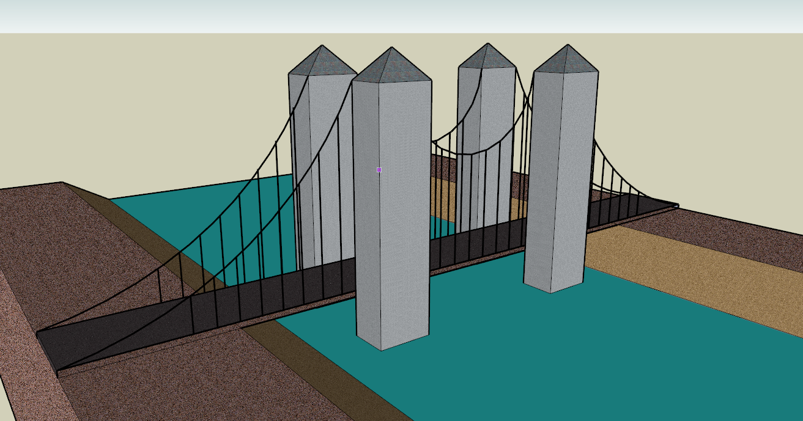
image::figures/inwork/Figure_44_3.png[]
.Examples for bridge models in LOD1 (upper left), LOD2 (upper right), LOD3 (lower left) and LOD4 (lower right) (source: Google 3D warehouse)
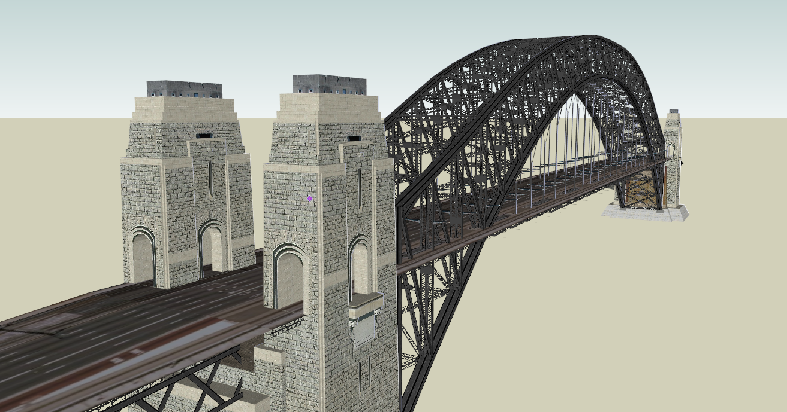

The bridge model was developed in analogy to the building model (cf. chapter 10.3) with regard to structure and attributes. The UML diagram of the bridge model is depicted in Fig. 45.

[[figure-45]]
.UML diagram of the bridge model, part one
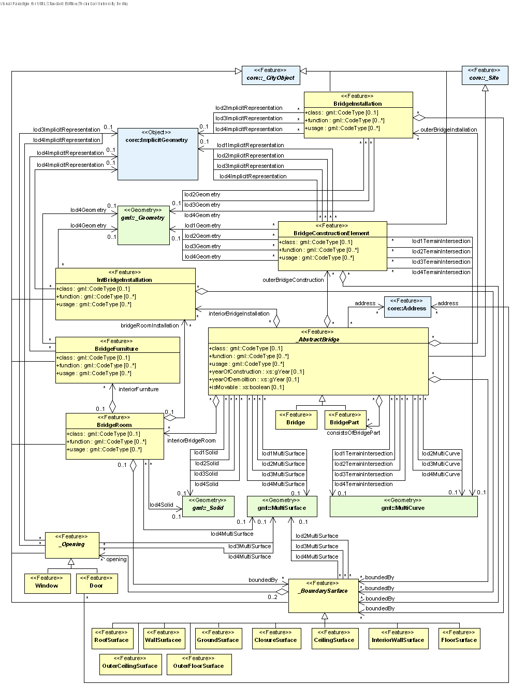

A (movable or unmovable) bridge is represented by an object of the class Bridge. This class inherits its attributes and relations from the abstract base class _AbstractBridge. The spatial properties are defined by a solid for each of the four LODs (relations lod1Solid to lod4Solid). In analogy to the building model, the semantical as well as the geometrical richness increases from LOD1 (blocks model) to LOD3 (architectural model). Simple examples of bridges in each of those LODs are depicted in Fig. 46. Interior structures like rooms are dedicated to LOD4. To cover the case of bridge models where the topology does not satisfy the properties of a solid (essentially water tightness), a multi surface representation is allowed (lod1MultiSurface to lod4MultiSurface). The line where the bridge touches the terrain surface is represented by a terrain intersection curve, which is provided for each LOD (relations lod1TerrainIntersection to lod4TerrainIntersection). In addition to the solid representation of a bridge, linear characteristics like ropes or antennas can be specified geometrically by the lod1MultiCurve to lod4MultiCurve relations. If those characteristics shall be represented semantically, the features BridgeInstalla-tion or BridgeConstructionElement can be used (see section 10.5.2). All relations to semantic objects and geo-metric properties are listed in Tab. 7.

[[figure-46]]
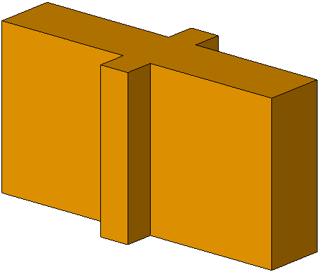
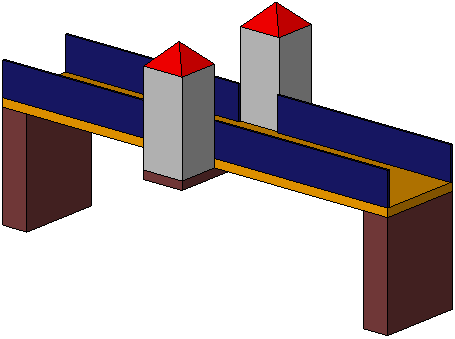
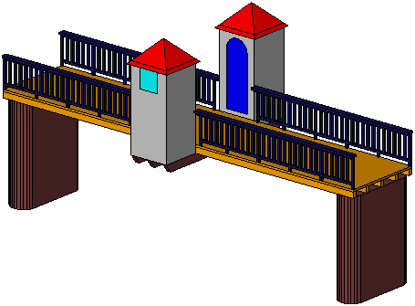
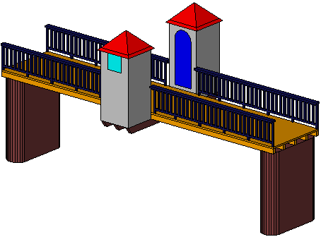
image::figures/inwork/Figure_46_5.png[]
image::figures/inwork/Figure_46_6.png[]
image::figures/inwork/Figure_46_7.png[]
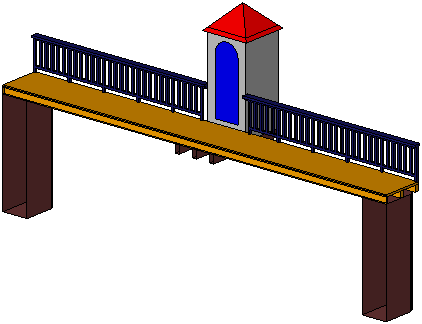
image::figures/inwork/Figure_46_9.png[]
image::figures/inwork/Figure_46_10.png[]
image::figures/inwork/Figure_46_11.png[]
.Bridge model in LOD1 – LOD4. (source: Karlsruhe Institute of Technology (KIT))
image::figures/inwork/Figure_46_12.png[]

The semantic attributes of an _AbstractBridge are class, function, usage and is_movable. The attribute class is used to classify bridges, e.g. to distinguish different construction types (cf. Fig. 48). The attribute function allows representing the utilization of the bridge independently of the construction. Possible values may be railway bridge, roadway bridge, pedestrian bridge, aqueduct, etc. The option to denote a usage which is divergent to one of the primary functions of the bridge (function) is given by the attribute usage. The type of these attributes is gml:CodeType, the values of which can be defined in code lists. The name of the bridge can be represented by the gml:name attribute, which is inherited from the base class gml:_GML via the classes gml:_Feature, _CityObject, and _Site. Each Bridge or BridgePart feature may be assigned zero or more addresses using the address property. The corresponding AddressPropertyType is defined within the CityGML core module (cf. chapter 10.1.4).

[#abstractbridge_semantics,reftext='{table-caption} {counter:table-num}']
.Semantic themes of the class _AbstractBridge
[width="90%",cols="^4,^4,^2,^2,^2,^2",options="header"]
|===
|**Geometric / semantic theme**
|**Property  type**
|**LOD1**
|**LOD2**
|**LOD3**
|**LOD4**
|Volume part of the bridge shell
|gml:SolidType
|• |• |• |•
|Surface part of the bridge shell
|gml:MultiSurfaceType
|• |• |• |•
|Terrain intersection curve
|gml:MultiCurveType
|• |• |• |•
|Curve part of the bridge shell
|gml:MultiCurveType
| |• |• |•
|Bridge parts (chapter 10.5.1)
|BridgePartType
|• |• |• |•
|Boundary surfaces (chapter 10.5.3)
|AbstractBoundarySurfaceType
| |• |• |•
|Outer bridge installations (chapter 10.5.2)
|BridgeInstallationType
| |• |• |•
|Bridge construction elements (chapter 10.5.2)
|BridgeConstruction-ElementType
|• |• |• |•
|Openings (chapter 10.5.4)
|AbstractOpeningType
| | |• |•
|Bridge rooms (chapter 10.5.5)
|BridgeRoomType
| | | |•
|Interior bridge installations
|IntBridgeInstallationType
| | | |•
|===

The boolean attribute is_movable is defined to specify whether a bridge is movable or not. The modeling of the geometric aspects of the movement is delayed to later versions of this standard. Some types of movable bridges are depicted in Fig. 47.

NOTE: the following are annimated GIFs
[[figure-47]]
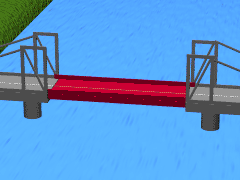
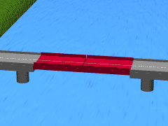
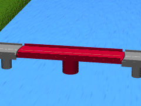
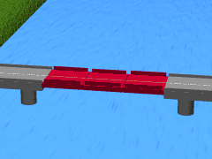
.Examples for movable bridges (source: ISO 6707).
image::figures/inwork/Figure_47_5.gif[]

[[figure-48]]
.Examples for different types of bridges.

NOTE: insert Fig 48 - currently these do not render.

==== Bridge and bridge part

===== BridgeType, Bridge

NOTE: insert BridgeType, Bridge UML

===== BridgePartType, BridgePart

NOTE: insert BridgePartType, BridgePart UML

If some parts of a bridge differ from the remaining bridge with regard to attribute values or if parts like ramps can be identified as objects of their own, those parts can be represented as BridgePart. A bridge can consist of multiple BridgeParts. Like Bridge, BridgePart is a subclass of _AbstractBridge and hence, has the same attrib-utes and relations. The relation consistOfBridgePart represents the aggregation hierarchy between a Bridge (or a BridgePart) and it’s BridgeParts. By this means, an aggregation hierarchy of arbitrary depth can be modeled. Each BridgePart belongs to exactly one Bridge (or BridgePart). Similar to the building model, the aggregation structure of a bridge forms a tree. A simple example for a bridge with parts is a twin bridge. Another example is presented in chapter 10.5.6.

===== AbstractBridgeType, _AbstractBridge

NOTE: insert AbstractBridgeType, _AbstractBridge UML

The abstract class _AbstractBridge is the base class of Bridges and BridgeParts. It contains properties for bridge attributes, purely geometric representations, and geometric/semantic representations of the bridge or bridge part in different levels of detail. The attributes describe:

. The classification of the bridge or bridge part (class), the different intended usages (function), and the different actual usages (usage). The permitted values for these property types can be specified in code lists.
. The year of construction (yearOfConstruction) and the year of demolition (yearOfDemolition) of the bridge or bridge part. These attributes can be used to describe the chronology of the bridge development within a city model. The points of time refer to real world time.
. Whether the bridge is movable is specified by the Boolean attribute isMovable.

==== Bridge construction elements and bridge installations

===== BridgeConstructionElementType, BridgeConstructionElement

NOTE: insert BridgeConstructionElementType, BridgeConstructionElement UML

===== BridgeInstallationType, BridgeInstallation

NOTE: insert BridgeInstallationType, BridgeInstallation UML

Bridge elements which do not have the size, significance or meaning of a BridgePart can be modelled either as BridgeConstructionElement or as BridgeInstallation. Elements which are essential from a structural point of view are modelled as BridgeConstructionElement, for example structural elements like pylons, anchorages etc. (cf. Fig. 49). A general classification as well as the intended and actual function of the construction element are represented by the attributes class, function, and usage. The geometry of a BridgeConstructionElement, which may be present in LOD1 to LOD4, is gml:_Geometry. Alternatively, the geometry may be given as ImplicitGe-ometry object. Following the concept of ImplicitGeometry the geometry of a prototype bridge construction element is stored only once in a local coordinate system and referenced by other bridge construction element features (cf. chapter 8.2). The visible surfaces of a bridge construction element can be semantically classified using the concept of boundary surfaces (cf. chapter 10.5.3).

Whereas a BridgeConstructionElement has structural relevance, a BridgeInstallation represents an element of the bridge which can be eliminated without collapsing of the bridge (e.g. stairway, antenna, railing). BridgeInstalla-tions occur in LOD 2 to 4 only and are geometrically representated as gml:_Geometry. Again, the concept of ImplicitGeometry can be applied to BridgeInstallations alternatively, and their visible surfaces can be semanti-cally classified using the concept of boundary surfaces (cf. chapter 10.5.3). The class BridgeInstallation contains the semantic attributes class, function and usage. The attribute class gives a classification of installations of a bridge. With the attributes function and usage, nominal and real functions of the bridge installation can be described. The type of all attributes is gml:CodeType and their values can be defined in code lists.

[[figure-49]]
.BridgeConstructionElements of a suspension bridge.
NOTE: insert Fig 49 - currently does not render

==== Boundary surfaces

===== AbstractBoundarySurfaceType, _BoundarySurface

NOTE: insert AbstractBoundarySurfaceType, _BoundarySurface UML

The thematic boundary surfaces of a bridge are defined in analogy to the building module. _BoundarySurface is the abstract base class for several thematic classes, structuring the exterior shell of a bridge as well as the visible surfaces of rooms, bridge construction elements and both outer and interior bridge installations. It is a subclass of _CityObject and thus inherits all properties like the GML3 standard feature properties (gml:name etc.) and the CityGML specific properties like ExternalReferences. From _BoundarySurface, the thematic classes RoofSur-face, WallSurface, GroundSurface, OuterCeilingSurface, OuterFloorSurface, ClosureSurface, FloorSurface, InteriorWallSurface, and CeilingSurface are derived.

For each LOD between 2 and 4, the geometry of a _BoundarySurface may be defined by a different gml:MultiSurface geometry.

In LOD3 and LOD4, a _BoundarySurface may contain _Openings (cf. chapter 10.5.4) like doors and windows. If the geometric location of _Openings topologically lies within a surface component (e.g. gml:Polygon) of the gml:MultiSurface geometry, these _Openings must be represented as holes within that surface. A hole is repre-sented by an interior ring within the corresponding surface geometry object. According to GML3, the points have to be specified in reverse order (exterior boundaries counter-clockwise and interior boundaries clockwise when looking in opposite direction of the surface’s normal vector). If such an opening is sealed by a Door, a Window, or a ClosureSurface, their outer boundary may consist of the same points as the inner ring (denoting the hole) of the surrounding surface. The embrasure surfaces of an Opening belong to the relevant adjacent _BoundarySurface. If, for example a door seals the Opening, the embrasure surface on the one side of the door belongs to the InteriorWallSurface and on the other side to the WallSurface.

Fig. 50 depicts a bridge with RoofSurfaces, WallSurfaces, OuterFloorSurfaces and OuterCeilingSurfaces. Besides Bridges and BridgeParts, BridgeConstructionElements, BridgeInstallations as well as IntBridgeInstalla-tions can be related to _BoundarySurface. _BoundarySurfaces occur in LOD2 to LOD4. In LOD3 and LOD4, such a surface may contain _Openings (see chapter 10.3.4) like doors and windows.

[[figure-50]]
.Different BoundarySurfaces of a bridge.
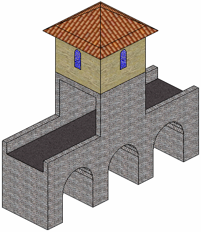

NOTE: need to add annotations to Figure 50

===== GroundSurfaceType, GroundSurface

NOTE: insert GroundSurfaceType, GroundSurface UML

The ground plate of a bridge or bridge part is modelled by the class GroundSurface. The polygon defining the ground plate is congruent with the bridge’s footprint. However, the surface normal of the ground plate is point-ing downwards.

===== OuterCeilingSurfaceType, OuterCeilingSurface

Note: insert OuterCeilingSurfaceType, OuterCeilingSurface UML

A mostly horizontal surface belonging to the outer bridge shell and having the orientation pointing downwards can be modeled as an OuterCeilingSurface.

===== WallSurfaceType, WallSurface

NOTE: insert WallSurfaceType, WallSurface UML

All parts of the bridge facade belonging to the outer bridge shell can be modelled by the class WallSurface

===== OuterFloorSurfaceType, OuterFloorSurface

NOTE: insert OuterFloorSurfaceType, OuterFloorSurface UML

A mostly horizontal surface belonging to the outer bridge shell and with the orientation pointing upwards can be modeled as an OuterFloorSurface

===== RoofSurfaceType, RoofSurface

NOTE: insert RoofSurfaceType, RoofSurface UML

The major roof parts of a bridge or bridge part are expressed by the class RoofSurface.

===== ClosureSurfaceType, ClosureSurface

NOTE: insert ClosureSurfaceType, ClosureSurface UML

An opening in a bridge not filled by a door or window can be sealed by a virtual surface called ClosureSurface (cf. chapter 6.4). Hence, bridge with open sides can be virtually closed in order to be able to compute their volume. ClosureSurfaces are also used in the interior bridge model. If two rooms with a different are directly connected without a separating door, a ClosureSurface should be used to separate or connect the volumes of both rooms.

===== FloorSurfaceType, FloorSurface

NOTE: insert FloorSurfaceType, FloorSurface UML

The class FloorSurface must only be used in the LOD4 interior bridge model for modelling the floor of a bridge room.

===== InteriorWallSurfaceType, InteriorWallSurface

NOTE: insert InteriorWallSurfaceType, InteriorWallSurface UML

The class InteriorWallSurface must only be used in the LOD4 interior bridge model for modelling the visible surfaces of the bridge room walls.

===== CeilingSurfaceType, CeilingSurface

NOTE: insert CeilingSurfaceType, CeilingSurface UML

The class CeilingSurface must only be used in the LOD4 interior bridge model for modelling the ceiling of a bridge room.

==== Openings

===== AbstractOpeningType, _Opening

NOTE: insert AbstractOpeningType, _Opening UML

The class _Opening is the abstract base class for semantically describing openings like doors or windows in outer or inner boundary surfaces like walls and roofs. Openings only exist in models of LOD3 or LOD4. Each _Opening is associated with a gml:MultiSurface geometry. Alternatively, the geometry may be given as Implic-itGeometry object. Following the concept of ImplicitGeometry the geometry of a prototype opening is stored only once in a local coordinate system and referenced by other opening features (see chapter 8.2).

===== WindowType, Window

NOTE: insert WindowType, Window UML

The class Window is used for modelling windows in the exterior shell of a bridge, or hatches between adjacent rooms. The formal difference between the classes Window and Door is that – in normal cases – Windows are not specifically intended for the transit of people or vehicles.

===== DoorType, Door

NOTE: insert DoorType, Door UML

The class Door is used for modelling doors in the exterior shell of a bridge, or between adjacent rooms. Doors can be used by people to enter or leave a bridge or room. In contrast to a ClosureSurface a door may be closed, blocking the transit of people. A Door may be assigned zero or more addresses. The corresponding Address-PropertyType is defined within the CityGML core module (cf. chapter 10.1.4).

==== Bridge Interior

The classes BridgeRoom, IntBridgeInstallation and BridgeFurniture allow for the representation of the bridge interior. They are designed in analogy to the classes Room, IntBuildingInstallation and BuildingFurniture of the building module and share the same meaning. The bridge interior can only be modeled in LOD4.

===== BridgeRoomType, BridgeRoom

NOTE: insert BridgeRoomType, BridgeRoom UML

A BridgeRoom is a semantic object for modelling the free space inside a bridge and should be uniquely related to exactly one bridge or bridge part object. It should be closed (if necessary by using ClosureSurfaces) and the geometry normally will be described by a solid (lod4Solid). However, if the topological correctness of the boundary cannot be guaranteed, the geometry can alternatively be given as a MultiSurface (lod4MultiSurface). The surface normals of the outer shell of a GML solid must point outwards. This is important to consider when BridgeRoom surfaces should be assigned Appearances. In this case, textures and colors must be placed on the backside of the corresponding surfaces in order to be visible from the inside of the room.

In addition to the geometrical representation, different parts of the visible surface of a room can be modelled by specialised BoundarySurfaces (FloorSurface, CeilingSurface, InteriorWallSurface, and ClosureSurface; cf. chapter 10.5.3).

===== BridgeFurnitureType, BridgeFurniture

NOTE: insert BridgeFurnitureType, BridgeFurniture UML

BridgeRooms may have BridgeFurnitures and IntBridgeInstallations. A BridgeFurniture is a movable part of a room, such as a chair or furniture. A BridgeFurniture object should be uniquely related to exactly one room object. Its geometry may be represented by an explicit geometry or an ImplicitGeometry object. Following the concept of ImplicitGeometry the geometry of a prototype bridge furniture is stored only once in a local coordi-nate system and referenced by other bridge furniture features (see chapter 8.2).

===== IntBridgeInstallationType, IntBridgeInstallation

NOTE: insert IntBridgeInstallationType, IntBridgeInstallation UML

An IntBridgeInstallation is an object inside a bridge with a specialised function or semantic meaning. In contrast to BridgeFurniture, IntBridgeInstallations are permanently attached to the bridge structure and cannot be moved. Examples for IntBridgeInstallations are stairways, railings and heaters. Objects of the class IntBridgeInstallation can either be associated with a room (class BridgeRoom), or with the complete bridge / bridge part (class _AbstractBridge, cf. chapter 10.5.1). However, they should be uniquely related to exactly one room or one bridge / bridge part object. An IntBridgeInstallation optionally has attributes class, function and usage. The attribute class, which can only occur once, represents a general classification of the internal bridge component. With the attributes function and usage, nominal and real functions of a bridge installation can be described. For all three attributes the list of feasible values can be specified in a code list. For the geometrical representation of an IntBridgeInstallation, an arbitrary geometry object from the GML subset shown in Fig. 9 can be used. Alter-natively, the geometry may be given as ImplicitGeometry object. Following the concept of ImplicitGeometry the geometry of a prototype interior bridge installation is stored only once in a local coordinate system and refer-enced by other interior bridge installation features (see chapter 8.2). The visible surfaces of an interior bridge installation can be semantically classified using the concept of boundary surfaces (cf. 10.5.3).

[[ug_bridge_lod_section]]
==== Level of Detail

[[ug_bridge_uml_section]]
==== UML Model

[[ug_bridge_examples_section]]
==== Examples

The bridge of Rees crossing the Rhine in Germany has three bridge parts which are separated by pylons. Fig. 51 (left) depicts the Rees bridge model containing one Bridge feature which consists of three BridgePart features. The pylons, which are structurally essential, are represented by BridgeConstructionElements. On the top of the pylons, four lamps are located which are modeled as BridgeInstallation features (cf. right part of Fig. 51).

[[figure-51]]
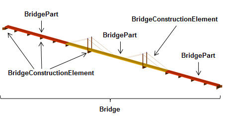
.The bridge of Rees, consisting of a Bridge feature and three BridgePart features (left). The bridge contains BridgeConstructionElement and BridgeInstallation features (right).
image::figures/inwork/Figure_51_b.png[]

In the following Fig. 52, the main part of the bridge of Rees is shown as photograph on the left side (source: Harald Halfpapp), and the corresponding part of the LOD2 bridge model is depicted on the the right side (source: District of Recklinghausen / KIT).

NOTE: Figures 52, 53 and 54 are from the images folder.

[[figure-52]]
.The bridge of Rees (left photo (source: Harald Halfpapp); right LOD2 model (source: District of Recklinghausen / KIT)).
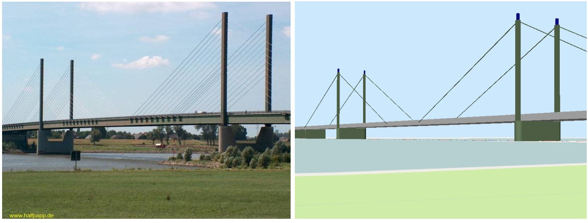[align="center"]

There are two bridges crossing the river Rhine at Karlsruhe, Germany. The first one is a two track railway bridge constructed as a truss bridge (cf. Fig. 53 front). The second one is a four lane highway bridge constructed as a cable-stayed bridge (cf. Fig. 53 background).

[[figure-53]]
.Bridge over the river Rhine at Karlsruhe (left a photo, right the 3D CityGML model) (source: Karlsruhe Institute of Technology (KIT), courtesy of City of Karlsruhe).
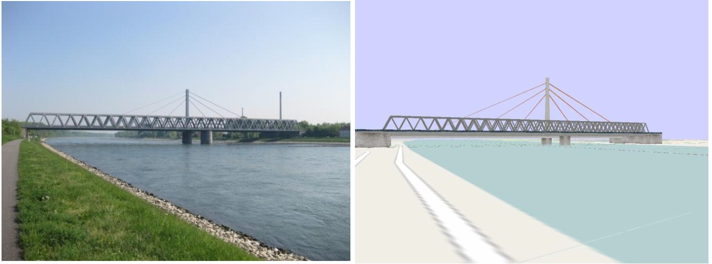[align="center"]

In CityGML both bridges are modeled as single Bridge object with BridgeConstructionElements and BridgeIn-stallations. The construction elements of the cable stayed bridge are the footings on both river sides and in the middle of the river, as well as the cables and the pylon. The construction elements of the truss bridge are the footings and the truss itself. Both bridges have several railings which are modeled as BridgeInstallation.
The bridge “Oberbaumbrücke” shown in Fig. 54 is located in the centre of Berlin crossing the river Spree and serves as example for bridges having interior rooms. The real-world bridge is depicted in the left part of Fig. 54, whereas the corresponding CityGML model is shown on the right. The outer geometry of the bridge is modeled as gml:MultiSurface element (lod4MultiSurface property) and is assigned photorealistic textures. Additionally, the interior rooms located in both bridge towers are represented as BridgeRoom objects with solid geometries (gml:Solid assigned through the lod4Solid property). Due to its geometric accuracy and the representation of the interior structures of both bridge towers, the model is classified as LOD4.

[[fig54]]
.The bridge“Oberbaumbrücke” in Berlin represented as bridge model in LOD4 (left a photo, right the 3D CityGML model) (source: Berlin Senate of Business, Technology and Women; Business Location Center, Berlin; Technische Universität Berlin; Karlsruhe Institute of Technology (KIT)).
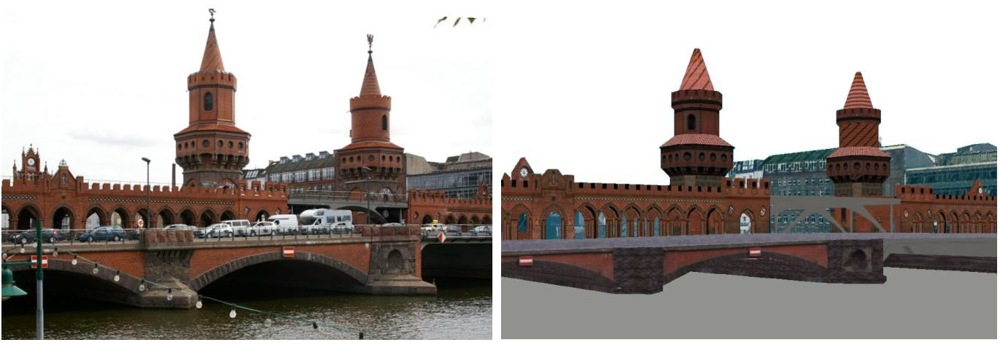[align="center"]

