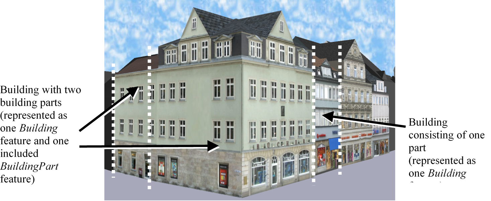
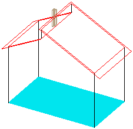
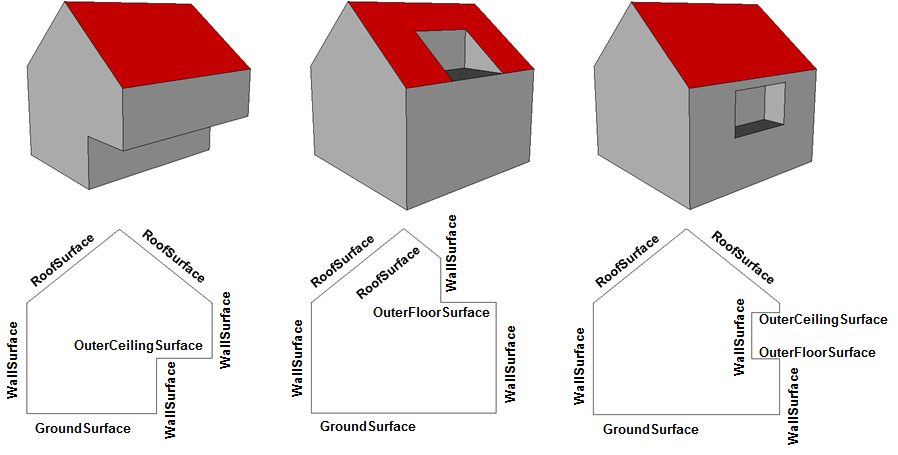
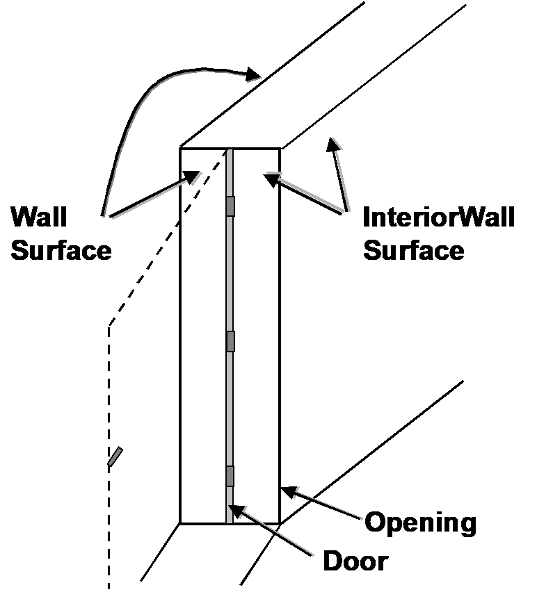
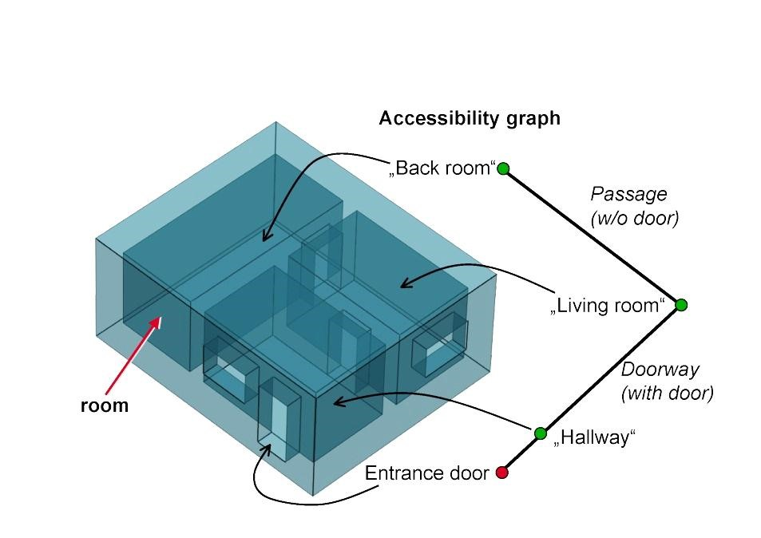
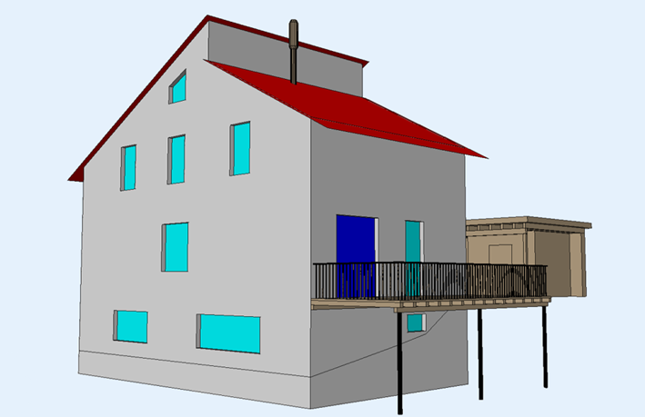

[[ug_model_building_section]]
=== Building Model

|===
^|*Contributors*
|TBD
|===

NOTE: The following text needs to be reviewed and updated.

The building model is one of the most detailed thematic concepts of CityGML. It allows for the representation of thematic and spatial aspects of buildings and building parts in five levels of detail, LOD0 to LOD4. The building model of CityGML is defined by the thematic extension module Building (cf. chapter 7). Fig. 26 provides examples of 3D city and building models in LOD1 – 4.

[[figure-26]]
.Examples for city or building models in LOD1 (upper left), LOD2 (upper right), LOD3 (lower left), and LOD4 (lower right) (source: District of Recklinghausen, m-g-h ingenieure+architekten GmbH).
image::images/Fig26.jpg[]

NOTE: this figure needs to be re-built.

The UML diagram of the building model is depicted in Fig. 27, for the XML schema definition see annex A.4 and below. The pivotal class of the model is _AbstractBuilding, which is a subclass of the thematic class _Site (and transitively of the root class _CityObject). _AbstractBuilding is specialised either to a Building or to a BuildingPart. Since an _AbstractBuilding consists of BuildingParts, which again are _AbstractBuildings, an aggregation hierarchy of arbitrary depth may be realised. As subclass of the root class _CityObject, an _AbstractBuilding inherits all properties from _CityObject like the GML3 standard feature properties (gml:name etc.) and the CityGML specific properties like ExternalReferences (cf. chapter 6.7). Further properties not explicitly covered by _AbstractBuilding may be modelled as generic attributes provided by the CityGML Generics module (cf. chapter 10.12) or using the CityGML Application Domain Extension mechanism (cf. chapter 10.13).

Building complexes, which consist of a number of distinct buildings like a factory site or hospital complex, should be aggregated using the concept of CityObjectGroups (cf. chapter 6.8). The main building of the complex can be denoted by providing “main building” as the role name of the corresponding group member.

Both classes Building and BuildingPart inherit the attributes of _AbstractBuilding: the class of the building, the function (e.g. residential, public, or industry), the usage, the year of construction, the year of demolition, the roof type, the measured height, and the number and individual heights of the storeys above and below ground. This set of parameters is suited for roughly reconstructing the three-dimensional shape of a building and can be provided by cadastral systems. Furthermore, Address features can be assigned to Buildings or BuildingParts.

[[figure-27]]
.UML diagram of CityGML’s building model. Prefixes are used to indicate XML namespaces associated with model elements. Element names without a prefix are defined within the CityGML Building module.
image::figures/Figure_27.png[]

The geometric representation and semantic structure of an _AbstractBuilding is shown in Fig. 27. The model is successively refined from LOD0 to LOD4. Therefore, not all components of a building model are represented equally in each LOD and not all aggregation levels are allowed in each LOD. In CityGML, all object classes are associated to the LODs with respect to the proposed minimum acquisition criteria for each LOD (cf. chapter 6.2). An object can be represented simultaneously in different LODs by providing distinct geometries for the corresponding LODs.

In LOD0, the building can be represented by horizontal, 3-dimensional surfaces. These can represent the foot-print of the building and, separately, the roof edge. This allows the easy integration of 2D data into the model. In many countries these 2D geometries readily exist, for example in cadastral or topographic data holdings. Cadas-tre data typically depicts the shape of the building on the ground (footprints) and topographic data is often a mixture between footprints and geometries at roof level (roof edges), which are often photogrametrically extract-ed from area/satellite images or derived from airborne laser data. The building model allows the inclusion of both. In this case large overhanging roofs can be modelled as a preliminary stage to more detailed LOD2 and LOD3 depictions. The surface geometries require 3D coordinates, though it is mandated that the height values of all vertices belonging to the same surface are identical. If 2D geometries are imported into any of these two LOD0 geometries, an appropriate height value for all vertices needs to be chosen. The footprint is typically located at the lowest elevation of the ground surface of the building whereas the roof edge representation should be placed at roof level (e.g., eaves height).

In LOD1, a building model consists of a generalized geometric representation of the outer shell. Optionally, a gml:MultiCurve representing the TerrainIntersectionCurve (cf. chapter 6.5) can be specified. This geometric representation is refined in LOD2 by additional gml:MultiSurface and gml:MultiCurve geometries, used for modelling architectural details like roof overhangs, columns, or antennas. In LOD2 and higher LODs the outer facade of a building can also be differentiated semantically by the classes _BoundarySurface and BuildingInstal-lation. A _BoundarySurface is a part of the building’s exterior shell with a special function like wall (WallSur-face), roof (RoofSurface), ground plate (GroundSurface), outer floor (OuterFloorSurface), outer ceiling (Outer-CeilingSurface) or ClosureSurface. The BuildingInstallation class is used for building elements like balconies, chimneys, dormers or outer stairs, strongly affecting the outer appearance of a building. A BuildingInstallation may have the attributes class, function, and usage (cf. Fig. 27).

In LOD3, the openings in _BoundarySurface objects (doors and windows) can be represented as thematic ob-jects. In LOD4, the highest level of resolution, also the interior of a building, composed of several rooms, is represented in the building model by the class Room. This enlargement allows a virtual accessibility of buildings, e.g. for visitor information in a museum (“Location Based Services“), the examination of accommodation standards or the presentation of daylight illumination of a building. The aggregation of rooms according to arbitrary, user defined criteria (e.g. for defining the rooms corresponding to a certain storey) is achieved by employing the general grouping concept provided by CityGML (cf. chapter 10.3.6). Interior installations of a building, i.e. objects within a building which (in contrast to furniture) cannot be moved, are represented by the class IntBuildingInstallation. If an installation is attached to a specific room (e.g. radiators or lamps), they are associated with the Room class, otherwise (e.g. in case of rafters or pipes) with _AbstractBuilding. A Room may have the attributes class, function and usage whose value can be defined in code lists (chapter 10.3.8 and annex C.1). The class attribute allows a classification of rooms with respect to the stated function, e.g. commercial or private rooms, and occurs only once. The function attribute is intended to express the main purpose of the room, e.g. living room, kitchen. The attribute usage can be used if the way the object is actually used differs from the function. Both attributes can occur multiple times.

The visible surface of a room is represented geometrically as a Solid or MultiSurface. Semantically, the surface can be structured into specialised _BoundarySurfaces, representing floor (FloorSurface), ceiling (CeilingSur-face), and interior walls (InteriorWallSurface). Room furniture, like tables and chairs, can be represented in the CityGML building model with the class BuildingFurniture. A BuildingFurniture may have the attributes class, function and usage. Annexes G.1 to G.6 provide example CityGML documents containing a single building model which is subsequently refined from a coarse LOD0 representation up to a semantically rich and geomet-ric-topologically sound LOD4 model including the building interior.

==== Building and Building Part

NOTE: Version 2.0 uses XML schema to illustrate this section. Replace those schema with UML.

===== BuildingType, Building

NOTE: Insert BuildingType, Building UML

The Building class is one of the two subclasses of _AbstractBuilding. If a building only consists of one (homo-geneous) part, this class shall be used. A building composed of structural segments differing in, for example the number of storeys or the roof type has to be separated into one Building having one or more additional Build-ingPart (see Fig. 28). The geometry and non-spatial properties of the central part of the building should be represented in the aggregating Building feature.

===== BuildingType, Building Part

NOTE: Insert BuildingType, Building Part UML

The class BuildingPart is derived from _AbstractBuilding. It is used to model a structural part of a building (see Fig. 28). A BuildingPart object should be uniquely related to exactly one building or building part object.

[[figure-28]]
.Examples of buildings consisting of one and two building parts (source: City of Coburg)

===== AbstractBuildingType, _AbstractBuilding

NOTE: AbstractBuildingType, _AbstractBuilding UML

The abstract class _AbstractBuilding contains properties for building attributes, purely geometric representations, and geometric/semantic representations of the building or building part in different levels of detail. The attributes describe:

. classification of the building or building part (class), the different intended usages (function), and the different actual usages (usage). The permitted values for these attributes can be specified in code lists.
. The year of construction (yearOfConstruction) and the year of demolition (yearOfDemolition) of the build-ing or building part. These attributes can be used to describe the chronology of the building development within a city model. The points of time refer to real world time.
. The roof type of the building or building part (roofType). The permitted values for this attribute can be specified in a code list.
. The measured relative height (measuredHeight) of the building or building part.
. The number of storeys above (storeyAboveGround) and below (storeyBelowGround) ground level.
. The list of storey heights above (storeyHeightsAboveGround) and below (storeyHeightsBelowGround) ground level. The first value in a list denotes the height of the nearest storey wrt. to the ground level and last value the height of the farthest.

Spanning the different levels of detail, the building model differs in the complexity and granularity of the geo-metric representation and the thematic structuring of the model into components with a special semantic mean-ing. This is illustrated in Fig. 29 and Fig. 30, showing the same building in five different LODs. The class _AbstractBuilding has a number of properties which are associated with certain LODs.

[[figure-29]]

.The two possibilities of modeling a building in LOD0 using horizontal 3D surfaces. On the left, the building footprint (lod0FootPrint) is shown (cyan) which denotes the shape of the building on the ground. The corresponding surface representation is located at ground level. On the right, the lod0RoofEgde representation is illustrated (cyan) which results from a horizontal projection of the building’s roof and which is located at the eaves height (source: Karlsruhe Institute of Technology (KIT), courtesy of Franz-Josef Kaiser).
image::figures/inwork/Figure_29_b.png[]

[[figure-30]]
.Building model in LOD1 – LOD4 (source: Karlsruhe Institute of Technology (KIT), courtesy of Franz-Josef Kaiser).<o:p></o:p>
image::figures/inwork/Figure_30.png[]

Tab. 5 shows the correspondence of the different geometric and semantic themes of the building model to LODs. In LOD1 – 4, the volume of a building can be expressed by a gml:Solid geometry and/or a gml:MultiSurface geometry. The definition of a 3D Terrain Intersection Curve (TIC), used to integrate buildings from different sources with the Digital Terrain Model, is also possible in LOD1 – 4. The TIC can – but does not have to – build closed rings around the building or building parts.

In LOD0 (cf. Fig. 29) the building is represented by horizontal surfaces describing the footprint and the roof edge.

In LOD1 (cf. Fig. 30), the different structural entities of a building are aggregated to a simple block and not differentiated in detail. The volumetric and surface parts of the exterior building shell are identical and only one of the corresponding properties (lod1Solid or lod1MultiSurface) must be used.

In LOD2 and higher levels of detail, the exterior shell of a building is not only represented geometrically as gml:Solid geometry and/or a gml:MultiSurface geometry, but it can also be composed of semantic objects. The base class for all objects semantically structuring the building shell is _BoundarySurface (cf. chapter 10.3.2), which is associated with a gml:MultiSurface geometry. If in a building model there is both a geometric represen-tation of the exterior shell as volume or surface model and a semantic representation by means of thematic _BoundarySurfaces, the geometric representation must not explicitly define the geometry, but has to reference the corresponding geometry components of the gml:MultiSurface of the _BoundarySurface elements.

[#abstractbuilding_semantics,reftext='{table-caption} {counter:table-num}']
.Semantic themes of the class _AbstractBuilding
[width="90%",cols="^4,^4,^2,^2,^2,^2,^2",options="header"]
|===
|**Geometric / semantic theme**
|**Property  type**|**LOD0**
|**LOD1**
|**LOD2**
|**LOD3**
|**LOD4**
|Building footprint and roof edge
|gml:MultiSurfaceType
|• | | | |
|Volume part of the building shell
|gml:SolidType
| |• |• |• |•
|Surface part of the building shell
|gml:MultiSurfaceType
| |• |• |• |•
|Terrain intersection curve
|gml:MultiCurveType
| |• |• |• |•
|Curve part of the building shell
|gml:MultiCurveType
| | |• |• |•
|Building parts
|BuildingPartType
| |• |• |• |•
|Boundary surfaces (chapter 10.3.3)
|AbstractBoundarySurfaceType
| | |• |• |•
|Outer building installations (chapter 10.3.2)
|BuildingInstallationType
| | |• |• |•
|Openings (chapter 10.3.4)
|AbstractOpeningType
| | | |• |•
|Rooms (chapter 10.3.5)
|RoomType
| | | | |•
|Interior building installations (chapter 10.3.5)
|IntBuildingInstallationType
| | | | |•
|===

Apart from BuildingParts, smaller features of the building (“outer building installations”) can also strongly affect the building characteristic. These features are modelled by the class BuildingInstallation (cf. chapter 10.3.2). Typical candidates for this class are chimneys (see. Fig. 30), dormers (see Fig. 28), balconies, outer stairs, or antennas. BuildingInstallations may only be included in LOD2 models, if their extents exceed the proposed minimum dimensions as specified in chapter 6.2. For the geometrical representation of the class Build-ingInstallation, an arbitrary geometry object from the GML subset shown in Fig. 9 can be used.

The class _AbstractBuilding has no additional properties for LOD3. Besides the higher requirements on geomet-ric precision and smaller minimum dimensions, the main difference of LOD2 and LOD3 buildings concerns the class _BoundarySurface (cf. chapter 10.3.3). In LOD3, openings in a building corresponding with windows or doors (see Fig. 30) are modelled by the abstract class _Opening and the derived subclasses Window and Door (cf. chapter 10.3.4).

With respect to the exterior building shell, the LOD4 data model is identical to that of LOD3. But LOD4 pro-vides the possibility to model the interior structure of a building with the classes IntBuildingInstallation and Room (cf. chapter 10.3.5).

Each Building or BuildingPart feature may be assigned zero or more addresses using the address property. The corresponding AddressPropertyType is defined within the CityGML core module (cf. chapter 10.1.4).

==== Outer building installations

===== BuildingInstallationType, BuildingInstallation 

Note: insert BuildingInstallation UML

A BuildingInstallation is an outer component of a building which has not the significance of a BuildingPart, but which strongly affects the outer characteristic of the building. Examples are chimneys, stairs, antennas, balconies or attached roofs above stairs and paths. A BuildingInstallation optionally has attributes class, function and usage. The attribute class - which can only occur once - represents a general classification of the installation. With the attributes function and usage, nominal and real functions of a building installation can be described. For all three attributes the list of feasible values can be specified in a code list. For the geometrical representation of a BuildingInstallation, an arbitrary geometry object from the GML subset shown in Fig. 9 can be used. Alterna-tively, the geometry may be given as ImplicitGeometry object. Following the concept of ImplicitGeometry the geometry of a prototype building installation is stored only once in a local coordinate system and referenced by other building installation features (see chapter 8.2). The visible surfaces of a building installation can be seman-tically classified using the concept of boundary surfaces (cf. 10.3.3). A BuildingInstallation object should be uniquely related to exactly one building or building part object.

==== Boundary surfaces

===== AbstractBoundarySurfaceType, _BoundarySurface

NOTE: Insert AbstractBoundarySurfaceType, _BoundarySurface UML

_BoundarySurface is the abstract base class for several thematic classes, structuring the exterior shell of a build-ing as well as the visible surfaces of rooms and both outer and interior building installations. It is a subclass of _CityObject and thus inherits all properties like the GML3 standard feature properties (gml:name etc.) and the CityGML specific properties like ExternalReferences. From _BoundarySurface, the thematic classes RoofSur-face, WallSurface, GroundSurface, OuterCeilingSurface, OuterFloorSurface, ClosureSurface, FloorSurface, InteriorWallSurface, and CeilingSurface are derived. The thematic classification of building surfaces is illustrat-ed in Fig. 31 (outer building shell) and Fig. 32 (additional interior surfaces) and subsequently specified.

For each LOD between 2 and 4, the geometry of a _BoundarySurface may be defined by a different gml:MultiSurface geometry.

In LOD3 and LOD4, a _BoundarySurface may contain _Openings (cf. chapter 10.3.4) like doors and windows. If the geometric location of _Openings topologically lies within a surface component (e.g. gml:Polygon) of the gml:MultiSurface geometry, these _Openings must be represented as holes within that surface. A hole is repre-sented by an interior ring within the corresponding surface geometry object. According to GML3, the points have to be specified in reverse order (exterior boundaries counter-clockwise and interior boundaries clockwise when looking in opposite direction of the surface’s normal vector). If such an opening is sealed by a Door, a Window, or a ClosureSurface, their outer boundary may consist of the same points as the inner ring (denoting the hole) of the surrounding surface. The embrasure surfaces of an Opening belong to the relevant adjacent _BoundarySurface. If, for example a door seals the Opening, the embrasure surface on the one side of the door belongs to the InteriorWallSurface and on the other side to the WallSurface (Fig. 32 on the right).

[[figure-31]]
.Examples of the classification of _BoundarySurfaces of the outer building shell (source: Karlsruhe Institute of Technology (KIT))

[[figure-32]]
image::figures/inwork/Figure_32_a.png[]
.Classification of BoundarySurfaces (left), in particular for Openings (right) (graphic: IGG Uni Bonn).

===== GroundSurfaceType, GroundSurface

NOTE: insert GroundSurfaceType, GroundSurface uml

The ground plate of a building or building part is modelled by the class GroundSurface. The polygon defining the ground plate is congruent with the building’s footprint. However, the surface normal of the ground plate is pointing downwards.

===== OuterCeilingSurfaceType, OuterCeilingSurface

NOTE: insert OuterCeilingSurfaceType, OuterCeilingSurface UML

A mostly horizontal surface belonging to the outer building shell and having the orientation pointing downwards can be modeled as an OuterCeilingSurface. Examples are the visible part of the ceiling of a loggia or the ceiling of a passage.

===== WallSurfaceType, WallSurface

NOTE: insert WallSurfaceType, WallSurface UML

All parts of the building facade belonging to the outer building shell can be modelled by the class WallSurface.

===== OuterFloorSurfaceType, OuterFloorSurface

NOTE: insert OuterFloorSurfaceType, OuterFloorSurface UML

A mostly horizontal surface belonging to the outer building shell and with the orientation pointing upwards can be modeled as an OuterFloorSurface. An example is the floor of a loggia.

===== RoofSurfaceType, RoofSurface

NOTE: insert RoofSurfaceType, RoofSurface UML

The major roof parts of a building or building part are expressed by the class RoofSurface. Secondary parts of a roof with a specific semantic meaning like dormers or chimneys should be modelled as BuildingInstallation.

===== ClosureSurfaceType, ClosureSurface

NOTE: insert ClosureSurfaceType, ClosureSurface UML

An opening in a building not filled by a door or window can be sealed by a virtual surface called ClosureSurface (cf. chapter 6.4). Hence, buildings with open sides like a barn or a hangar, can be virtually closed in order to be able to compute their volume. ClosureSurfaces are also used in the interior building model. If two rooms with a different function (e.g. kitchen and living room) are directly connected without a separating door, a ClosureSur-face should be used to separate or connect the volumes of both rooms.

===== FloorSurfaceType, FloorSurface

NOTE: insert FloorSurfaceType, FloorSurface UML

The class FloorSurface must only be used in the LOD4 interior building model for modelling the floor of a room.

===== InteriorWallSurfaceType, InteriorWallSurface

NOTE: insert InteriorWallSurfaceType, InteriorWallSurface UML

The class InteriorWallSurface must only be used in the LOD4 interior building model for modelling the visible surfaces of the room walls.

===== CeilingSurfaceType, CeilingSurface

NOTE: Insert CeilingSurfaceType, CeilingSurface UML

The class CeilingSurface must only be used in the LOD4 interior building model for modelling the ceiling of a room.

==== Openings

===== AbstractOpeningType, _Opening

NOTE: insert AbstractOpeningType, _Opening UML

The class _Opening is the abstract base class for semantically describing openings like doors or windows in outer or inner boundary surfaces like walls and roofs. Openings only exist in models of LOD3 or LOD4. Each _Opening is associated with a gml:MultiSurface geometry. Alternatively, the geometry may be given as Implic-itGeometry object. Following the concept of ImplicitGeometry the geometry of a prototype opening is stored only once in a local coordinate system and referenced by other opening features (see chapter 8.2).

===== WindowType, Window

NOTE: insert WindowType, Window UML

The class Window is used for modelling windows in the exterior shell of a building, or hatches between adjacent rooms. The formal difference between the classes Window and Door is that – in normal cases – Windows are not specifically intended for the transit of people or vehicles.

===== DoorType, Door

NOTE: insert DoorType, Door UML

The class Door is used for modelling doors in the exterior shell of a building, or between adjacent rooms. Doors can be used by people to enter or leave a building or room. In contrast to a ClosureSurface a door may be closed, blocking the transit of people. A Door may be assigned zero or more addresses. The corresponding Address-PropertyType is defined within the CityGML core module (cf. chapter 10.1.4) .

==== Building Interior

===== RoomType, Room

NOTE: insert RoomType, Room UML

A Room is a semantic object for modelling the free space inside a building and should be uniquely related to exactly one building or building part object. It should be closed (if necessary by using ClosureSurfaces) and the geometry normally will be described by a solid (lod4Solid). However, if the topological correctness of the boundary cannot be guaranteed, the geometry can alternatively be given as a MultiSurface (lod4MultiSurface). The surface normals of the outer shell of a GML solid must point outwards. This is important to consider when Room surfaces should be assigned Appearances. In this case, textures and colors must be placed on the backside of the corresponding surfaces in order to be visible from the inside of the room.

In addition to the geometrical representation, different parts of the visible surface of a room can be modelled by specialised BoundarySurfaces (FloorSurface, CeilingSurface, InteriorWallSurface, and ClosureSurface cf. chapter 10.3.3).

A special task is the modelling of passages between adjacent rooms. The room solids are topologically connected by the surfaces representing hatches, doors or closure surfaces that seal open doorways. Rooms are defined as being adjacent, if they have common _Openings or ClosureSurfaces. The surface that represents the opening geometrically is part of the boundaries of the solids of both rooms, or the opening is referenced by both rooms on the semantic level. This adjacency implies an accessibility graph, which can be employed to determine the spread of e.g. smoke or gas, but which can also be used to compute escape routes using classical shortest path algorithms (see Fig. 33).

[[figure-33]]
.Accessibility graph derived from topological adjacencies of room surfaces (graphic: IGG Uni Bonn).

===== BuildingFurnitureType, BuildingFurniture

NOTE: insert BuildingFurnitureType, BuildingFurniture UML

Rooms may have BuildingFurnitures and IntBuildingInstallations. A BuildingFurniture is a movable part of a room, such as a chair or furniture. A BuildingFurniture object should be uniquely related to exactly one room object. Its geometry may be represented by an explicit geometry or an ImplicitGeometry object. Following the concept of ImplicitGeometry the geometry of a prototype building furniture is stored only once in a local coordi-nate system and referenced by other building furniture features (see chapter 8.2).

===== IntBuildingInstallationType, IntBuildingInstallation

NOTE: insert IntBuildingInstallationType, IntBuildingInstallation UML

An IntBuildingInstallation is an object inside a building with a specialised function or semantic meaning. In contrast to BuildingFurniture, IntBuildingInstallations are permanently attached to the building structure and cannot be moved. Typical examples are interior stairs, railings, radiators or pipes. Objects of the class IntBuild-ingInstallation can either be associated with a room (class Room), or with the complete building / building part (class _AbstractBuilding, cf. chapter 10.3.1). However, they should be uniquely related to exactly one room or one building / building part object. An IntBuildingInstallation optionally has attributes class, function and usage. The attribute class, which can only occur once, represents a general classification of the internal building com-ponent. With the attributes function and usage, nominal and real functions of a building installation can be described. For all three attributes the list of feasible values can be specified in a code list. For the geometrical representation of an IntBuildingInstallation, an arbitrary geometry object from the GML subset shown in Fig. 9 can be used. Alternatively, the geometry may be given as ImplicitGeometry object. Following the concept of ImplicitGeometry the geometry of a prototype interior building installation is stored only once in a local coordi-nate system and referenced by other interior building installation features (see chapter 8.2). The visible surfaces of an interior building installation can be semantically classified using the concept of boundary surfaces (cf. 10.3.3).

==== Modelling building storeys using CityObjectGroups

CityGML does currently not provide a specific concept for the representation of storeys as it is available in the AEC/FM standard IFC (IAI 2006). However, a storey can be represented as an explicit aggregation of all build-ing features on a certain height level using CityGML’s notion of CityObjectGroups (cf. chapter 10.11). This would include Rooms, Doors, Windows, IntBuildingInstallations and BuildingFurniture. If thematic surfaces like walls and interior walls should also be associated to a specific storey, this might require the vertical fragmenta-tion of these surfaces (one per storey), as in virtual 3D city models they typically span the whole façade.

In order to model building storeys with CityGML’s generic grouping concept, a nested hierarchy of CityObject-Group objects has to be used. In a first step, all semantic objects belonging to a specific storey are grouped. The attributes of the corresponding CityObjectGroup object are set as follows:

* The class attribute shall be assigned the value “building separation”.
* The function attribute shall be assigned the value “lodXStorey” with X between 1 and 4 in order to de-note that this group represents a storey wrt. a specific LOD.
* The storey name or number can be stored in the gml:name property. The storey number attribute shall be assigned the value “storeyNo_X” with decimal number X in order to denote that this group repre-sents a storey wrt. a specific number.

In a second step, the CityObjectGroup objects representing different storeys are grouped themselves. By using the generic aggregation concept of CityObjectGroup, the “storeys group” is associated with the corresponding Building or BuildingPart object. The class attribute of the storeys group shall be assigned the value “building storeys”.

==== Examples

The LOD1 model of the Campus North of the Karlruhe Institute of Technology (KIT) shown in Fig. 34 consists of 596 buildings and 187 building parts. The footprint geometries of the buildings are taken from a cadastral information system and extruded by a given height. Buildings with a unique identifier and a single height value are modeled as one building (bldg:Building). Buildings having a unique identifier but different height values are modeled as one building (bldg:Building) with one or more building parts (bldg:BuildingPart). Both buildings and building parts have solid geometries and their height values are additionally represented as thematic attribute (bldg:measuredHeight). Fig. 34 shows an aerial photograph of the KIT Campus North (left) and the CityGML LOD1 model (right).

[[figure-34]]
image::figures/inwork/Figure_34_a.png[]
.LOD1 model of the KIT Campus North (source: Karlsruhe Institute of Technology (KIT)).
image::figures/inwork/Figure_34_b.png[]

An example for a fully textured LOD2 building model is given in Fig. 35 which shows the Bernhardus church located in the city of Karlsruhe, Germany. On the left side of Fig. 35, a photograph of the church in real world is shown whereas the CityGML building model of the church with photorealistic textures is illustrated on the right. The model is bounded by a ground surface, several wall and roof surfaces. The railing above the church clock is modeled as a building installation (BuildingInstallation).

[[figure-35]]
image::figures/inwork/Figure_35_a.png[]
.Textured LOD2 model of the Bernhardus church in Karlsruhe (source: Karlsruhe Institute of Technology (KIT), courtesy of City of Karlsruhe).
image::figures/inwork/Figure_35_b.png[]

The model shown in Fig. 36 was derived from a 3D CAD model generated during the planning phase of the building. On the left side of Fig. 36, the building is shown whereas on the right side the LOD3 model is present-ed. The building itself is bounded by wall surfaces, roof surfaces and a ground surface. Doors and windows are modeled including reveals. According to the cadaster data, the car port next to the building is not part of the building. Therefore the car port, the balcony and the chimney are modeled as building installations (BuildingIn-stallation). The model also contains the terrain intersection curve (lod3TerrainIntersection) as planned by the architect.

In order to determine the volume of the building, the geometries of all boundary surfaces, including doors and windows, are referenced by the building solid (lod3Solid) using the XLink mechanism. Consequently, the roof surfaces are split into surfaces representing the roof itself and surfaces representing the roof overhangs.

[[figure-36]]
image::figures/inwork/Figure_36_a.png[]
.Example of a buildingmodeled in the Level of Detail 3. The chimney, the balcony and the car port are modeled as building installations (source: Karlsruhe Institute of Technology (KIT), courtesy of Franz-Josef Kaiser).

