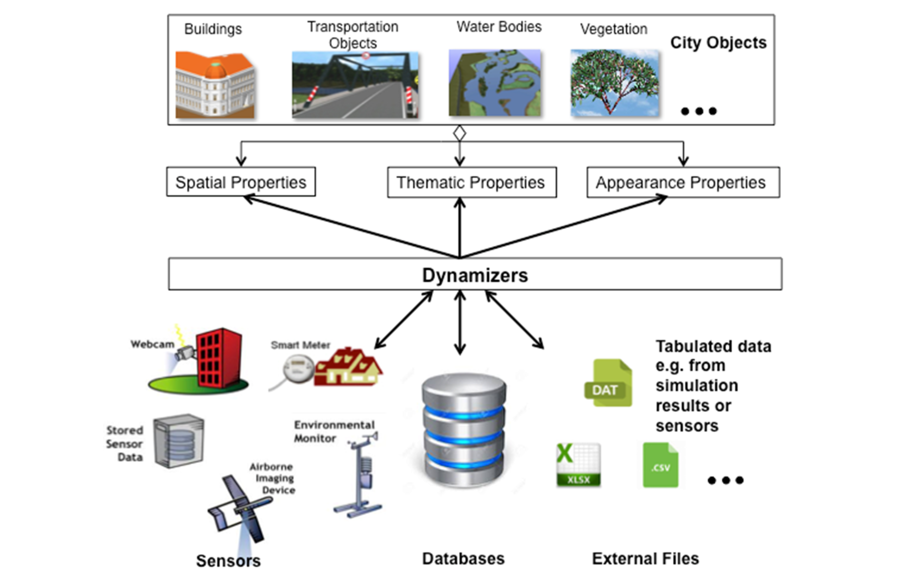

[[ug-dynamic-data-section]]
=== Modelling Dynamic Data

In general, city objects can have properties related to their geometry, topology, semantics, and appearance. All of these properties may change over time. For example, a construction event leads to the change in geometry of a building (i.e. addition of a new building floor or demolition of an existing door). The geometry of an object can be further classified according to its shape, location, and extent, which can also change over time. A moving car object involves changing only the location of the car object. However, a flood incident involves variations in the location and shape of water. There might be other properties, which change with respect to thematic data of city objects such as hourly variations in energy or gas consumption of a building or changing the building usage from residential to commercial. Some properties involve changes in appearances over a time period, such as building textures changing over years or traffic cameras recording videos of moving traffic over definite intervals. 3D city models also represent interrelationships between objects and relations may change over time as well. Hence, it is important to consider that the representation of time-varying data is required to be associated with these different properties. A detailed discussion on the requirements of city model applications regarding the support of dynamic data is given in [<<Chaturvedi2019>>].

The CityGML 3.0 Conceptual Model introduces two concepts to manage dynamic, time-dependent, properties of city models. The _Versioning_ module manages changes that are slower in nature. Examples are (1) the history or evolution of cities such as construction or demolition of buildings, and (2) managing multiple versions of the city models.

The _Dynamizer_ module manages higher-frequency or dynamic variations of object properties, including variations of (1) thematic attributes such as changes of physical quantities (energy demands, temperature, solar irradiation levels), (2) spatial properties such as change of a feature’s geometry, with respect to shape and location (moving objects), and (3) real-time sensor observations. The Dynamizer module allows establishing explicit links from city objects to sensors and sensor data services.

[[ug-versioning-and-history-section]]
==== Versioning and Histories

As described in <<semantic-modelling-section>>, the bitemporal timestamps of all CityGML feature types allow representing the evolution of the real city and its model over time. The new _Versioning_ module extends this concept by the possibility of representing multiple, concurrent versions of the city model. For that purpose, the module defines two new feature types: 1) _Version_, which can be used to explicitly define named states of the 3D city model and denote all the specific versions of objects belonging to such states. 2) _VersionTransition_, which allows to explicitly link different versions of the 3D city model by describing the reason of change and the modifications applied. Details on the versioning concept are given in [<<Chaturvedi2015>>].

This approach not only facilitates the explicit representation of different city model versions, but also allows distinguishing and referring to different versions of city objects in an interoperable exchange format. All object versions could be stored and exchanged within a single dataset. Software systems could use such a dataset to visualize and work with the different versions simultaneously. The conceptual model also takes into account the management of multiple histories or multiple interpretations of the past of a city, which is required when looking at historical city developments and for archaeological applications. In addition, the Versioning module supports collaborative work. All functionality to represent a tree of workspaces as version control systems like _git_ or _SVN_ is provided. The Versioning module handles versions and version transitions as feature types, which allows the version management to be completely handled using the standard OGC Web Feature Service [<<Vretanos2010>>]. No extension of the OGC Web Feature Service standard is required to manage the versioning of city models.

[[ug-dynamizers-section]]
==== Dynamizers: Using Time-Series Data for Object Attributes

The new Dynamizer module improves the usability of CityGML for different kinds of simulations as well as to facilitate the integration of devices from the Internet-of-Things (IoT) like sensors with 3D city models. Both, simulations and sensors provide dynamic variations of some measured or simulated properties such as the electricity consumption of a building or the traffic density within a road segment. The variations of the value are typically represented using time-series data. The data sources of the time-series data could be either sensor observations (e.g. from a smart meter), pre-recorded load profiles (e.g. from an energy company), or the results of some simulation run.

[[figure-dynamizers,Figure {counter:figure-num}]]
.Dynamizers link timeseries data coming from different sources to specific properties of individual city objects.

As shown in <<figure-dynamizers>>, Dynamizers serve three main purposes:

. Dynamizer is a data structure to represent dynamic values in different and generic ways. Such dynamic values may be given by (1) tabulation of time/value pairs using its _AtomicTimeseries_ class, (2) patterns of time/value pairs based on statistical rules using its _CompositeTimeseries_ class, and (3) retrieving observations directly from external sensor/IoT services using its _SensorConnection_ class. The values can be obtained from sensor services such as the <<sos_citation,OGC Sensor Observation Service>> or <<sensorthing_citation,OGC SensorThings API>>, simulation specific databases, and also external files such as CSV or Excel sheets.
. Dynamizer delivers a method to enhance static city models by adding dynamic property values. A Dynamizer references a specific property (e.g. spatial, thematic or appearance properties) of a specific object within a 3D city model providing dynamic values overriding the static value of the referenced object attribute.
. Dynamizer objects establish explicit links between sensor/observation data and the respective properties of city model objects that are measured by them. By making such explicit links with city object properties, the semantics of sensor data become implicitly defined by the city model.

Dynamizers are used to inject dynamic variations of city object properties into an otherwise static representation. The advantage in following such an approach is that it allows only selected properties of city models to be made dynamic. If an application does not support dynamic data, the application simply does not allow/include these special types of features.

Dynamizers have already been implemented as an Application Domain Extension (ADE) for CityGML 2.0 and were employed in the OGC Future City Pilot Phase 1. More details about Dynamizers are given in [<<Chaturvedi2017>>].

