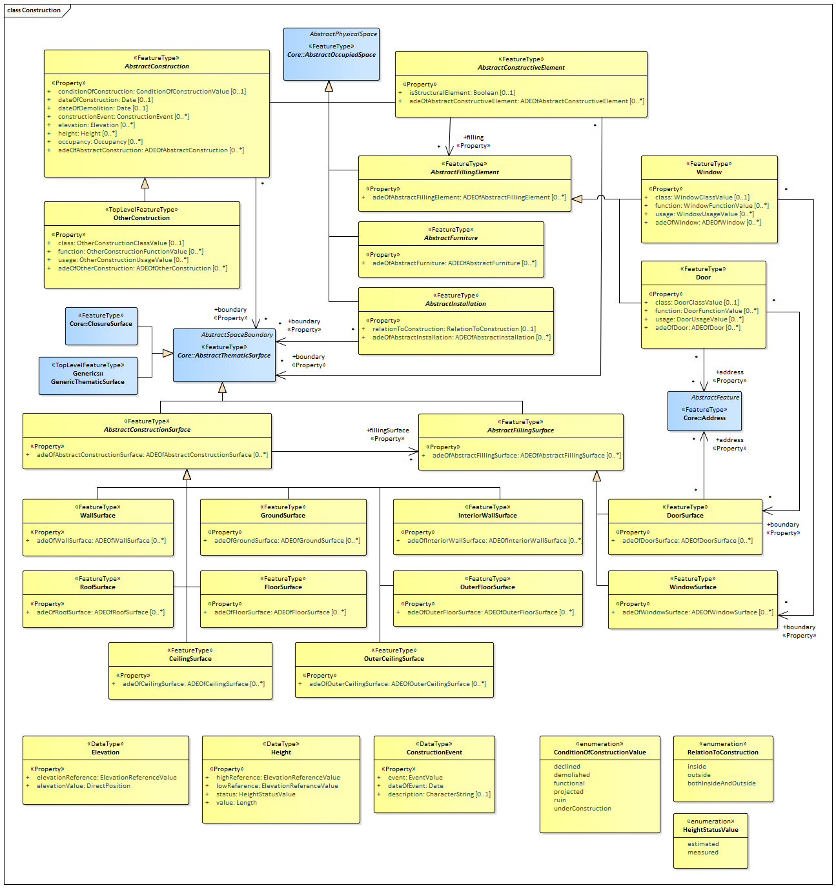

[[ug_model_construction_section]]
=== Construction

|===
^|*Contributors*
|TBD
|===

[[ug_construction_synopsis_section]]
==== Synopsis

[[ug_construction_concepts_section]]
==== Key Concepts

[[ug_construction_discussion_section]]
==== Discussion

[[ug_construction_lod_section]]
==== Level of Detail

[[ug_construction_uml_section]]
==== UML Model

The UML diagram of the Construction module is depicted in <<construction-uml>>.

[[construction-uml]]
.UML diagram of the Construction Model.

The ADE data types provided for the Construction module are illustrated in <<construction-uml-ade-types>>.

[[construction-uml-ade-types]]
.ADE classes of the CityGML Construction module.
image::../standard/figures/Construction-ADE_Datatypes.png[align="center"]

The Code Lists provided for the Construction module are illustrated in <<construction-uml-codelists>>.

[[construction-uml-codelists]]
.Codelists from the CityGML Construction module.
image::../standard/figures/Construction-Codelists.png[align="center"]

[[ug_construction_examples_section]]
==== Examples

