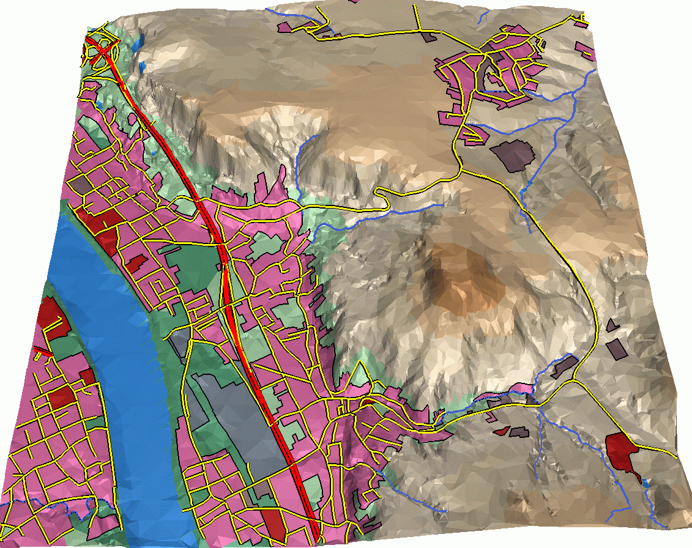
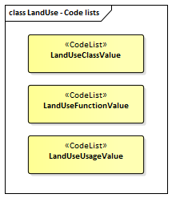

[[ug_model_land-use_section]]
=== Land Use

|===
^|*Contributors*
|C. Heazel - first draft
|===

[[ug_landuse_synopsis_section]]
==== Synopsis

The LandUse module defines objects that can be used to describe areas of the earth’s surface dedicated to a specific land use or having a specific land cover with or without vegetation, such as sand, rock, mud flats, forest, grasslands, or wetlands (i.e. the physical appearance).

[[ug_landuse_concepts_section]]
==== Key Concepts

[[landuse-concept]]
*LandUse*: An area of the earth's surface dedicated to a specific land use or having a specific land cover with or without vegetation, such as sand, rock, mud flats, forest, grasslands, or wetlands. +
A type of <<abstract-thematic-surface-concept,AbstractThematicSurface>>.

[[ug_landuse_discussion_section]]
==== Discussion

LandUse objects can be used to describe areas of the earth’s surface dedicated to a specific land use, but also to describe areas of the earth’s surface having a specific land cover with or without vegetation, such as sand, rock, mud flats, forest, grasslands, etc (i.e. the physical appearance). 

Land use and land cover are different concepts. The first describes human activities on the earth’s surface, the second describes its physical and biological cover. However, the two concepts are interlinked and often mixed in practice. Land use objects in CityGML support both concepts: They can be employed to represent parcels, spatial planning objects, recreational objects, and objects describing the physical characteristics of an area in 3D.

Land use objects are represented in the UML model by the top-level feature type <<landuse-concept,LandUse>>, which is also the only class of the LandUse module.

Every LandUse object may have the attributes `class`, `function`, and `usage`. The `class` attribute is used to represent the classification of land use objects, like settlement area, industrial area, farmland etc., and can occur only once. The possible values can be specified in a code list (cf. <<ug_codelist_section>>). The attribute `function` defines the purpose of the object or their nature, like e.g. cornfield or heath, while the attribute `usage` can be used, if the way the object is actually used differs from the function. Both the `function` and `usage` attributes can occur multiple times.

The LandUse object is defined for all LOD 0-3 and may have different geometries in any LOD. The surface geometry of a LandUse object is required to have 3D coordinate values. It must be a <<GM_MultiSurface-section,GM_MultiSurface>>, which might be assigned appearance properties like textures or colors (see <<ug_appearance_section>>.

LandUse objects can be employed to establish a coherent geometric/semantical tesselation of the earth’s surface. In this case topological relations between neighbouring LandUse objects should be made explicit by defining the <<abstract-space-boundary-concept,space boundary>> only once and by referencing it in the corresponding <<abstract-city-object-concept,City Object>>.

[[figure-72]]
.LOD0 regional model consisting of land use objects in CityGML (source: IGG Uni Bonn).

[[ug_landuse_uml_section]]
==== UML Model

The UML diagram of the LandUse module is depicted in <<landuse-uml>>. 

[[landuse-uml]]
.UML diagram of the Land Use Model.

image::../standard/figures/LandUse.png[align="center"]

The ADE data types provided for the Land Use module are illustrated in <<landuse-uml-ade-types>>.

[[landuse-uml-ade-types]]
.ADE classes of the CityGML Land Use module.
image::../standard/figures/LandUse-ADE_Datatypes.png[align="center"]

The Code Lists provided for the Land Use module are illustrated in <<landuse-uml-codelists>>.

[[landuse-uml-codelists]]
.Codelists from the CityGML Land Use module.

[[ug_landuse_examples_section]]
==== Examples

