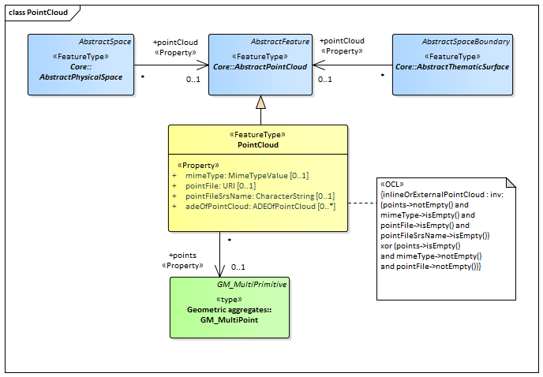
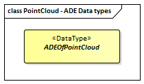

[[ug_model_point-cloud_section]]
=== Point Cloud

|===
^|*Contributors*
|C. Heazel - first draft
|===

[[ug_point-cloud_synopsis_section]]
==== Synopsis

The PointCloud module specifies how to encode the geometry of physical spaces and of thematic surfaces as 3D point clouds. In this way, the building hull, a room within a building or a single wall surface can be spatially represented by a point cloud only.

[[ug_point-cloud_concepts_section]]
==== Key Concepts

<<pointcloud-concept,*PointCloud*>>: A PointCloud is an unordered collection of points that is a sampling of the geometry of a space or space boundary. +
A type of <<abstract-pointcloud-concept,AbstractPointCloud>>.

[[ug_point-cloud_discussion_section]]
==== Discussion

The PointCloud module specifies how to encode the geometry of physical spaces and of thematic surfaces as 3D point clouds. In this way, the building hull, a room within a building or a single wall surface can be spatially represented by a point cloud only. The same applies to all other thematic feature types including transportation objects, vegetation, city furniture, etc. Point clouds can either be provided inline within a CityGML file or as reference to external point cloud files of common file types such as LAS or LAZ.

Point clouds are represented in the UML model by the feature type _PointCloud_, which is also the only class of the PointCloud module.

[[ug_point-cloud_uml_section]]
==== UML Model

The UML diagram of the PointCloud module is depicted in <<pointcloud-uml>>.

[[pointcloud-uml]]
.UML diagram of the Point Cloud Model.

The ADE data types provided for the Point Cloud module are illustrated in <<pointcloud-uml-ade-types>>.

[[pointcloud-uml-ade-types]]
.ADE classes of the CityGML Point Cloud module.

[[ug_point-cloud_example_section]]
==== Examples

