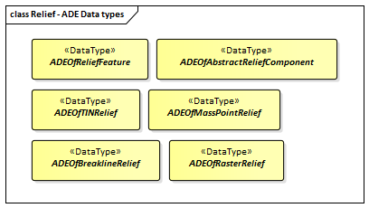

:sectnums:

[[ug_relief_section]]
=== Relief

|===
^|*Contributors*
|C. Heazel - first draft
|===

[[ug_relief_synopsis_section]]
==== Synopsis

The Relief module supports representation of the terrain. CityGML supports terrain representations at different levels of detail, reflecting different accuracies or resolutions. Terrain may be specified as a regular raster or grid, as a TIN, by break lines, and/or by mass points.

[[ug_relief_concepts_section]]
==== Key Concepts

[[relief-feature-concept]]
*ReliefFeature*: A collection of terrain components representing the Earth's surface, also known as the Digital Terrain Model. +
A type of <<abstract-space-boundary-concept,AbstractSpaceBoundary>>.

[[abstract-relief-component-concept]]
*AbstractReliefComponent*: An element of the terrain surface - either a TIN, a raster or grid, mass points or break lines. +
A type of <<abstract-space-boundary-concept,AbstractSpaceBoundary>>.

[[tin-relief-concept]]
*TINRelief*: A terrain component as a triangulated irregular network. +
A type of <<abstract-relief-component-concept,AbstractReliefComponent>>.

[[mass-point-relief-concept]]
*MassPointRelief*: A terrain component as a collection of 3D points. +
A type of <<abstract-relief-component-concept,AbstractReliefComponent>>.

[[breakline-relief-concept]]
*BreaklineRelief*: A terrain component with 3D lines. These lines denote break lines or ridge/valley lines. +
A type of <<abstract-relief-component-concept,AbstractReliefComponent>>.

[[raster-relief-concept]]
*RasterRelief*: A terrain component as a regular raster or grid. +
A type of <<abstract-relief-component-concept,AbstractReliefComponent>>.

[[ug_relief_discussion_section]]
==== Discussion

An essential part of a city model is the terrain. The Digital Terrain Model (DTM) of CityGML is provided by the thematic extension module Relief. In CityGML, the terrain is represented by the class <<relief-feature-concept,ReliefFeature>> in LOD 0-3. A <<relief-feature-concept,ReliefFeature>> consists of one or more entities of the class <<abstract-relief-component-concept,AbstractReliefComponent>>. Its validity may be restricted to a certain `extent` defined by an optional <<GM_Surface-section,GM_Surface>>. As <<relief-feature-concept,ReliefFeature>> and <<abstract-relief-component-concept,AbstractReliefComponent>> are derivatives of <<abstract-city-object-concept,AbstractCityObject>>, the corresponding attributes and relations are inherited. 

The class <<relief-feature-concept,ReliefFeature>> is associated, through <<abstract-relief-component-concept,AbstractReliefComponent>>, with different concepts of terrain representations which can coexist. The terrain may be specified:

* as a regular raster or grid (<<raster-relief-concept,RasterRelief>>),
* as a TIN (Triangulated Irregular Network - <<tin-releif-concept,TINReflief>>), 
* by break lines (<<breakline-relief-concept,BreaklineRelief>>), or 
* by mass points (<<mass-point-relief-concept,MasspointRelief>>). 

The four types are implemented by the corresponding ISO geometries:

* grids by <<CV_DiscreteGridPointCoverage-section,CV_DiscreteGridPointCoverage>>,
* break lines by <<GM_MultiCurve-section,GM_MultiCurve>>, 
* mass points by <<GM_MultiPoint-section,GM_MultiPoint>> and 
* TINs either by <<GM_TriangulatedSurface-section,GM_TriangulatedSurface>> or by <<GM_Tin-section,GM_Tin>>. 

In case of <<GM_TriangulatedSurface-section,GM_TriangulatedSurfaces>>, the triangles are given explicitly while in case of <<GM_Tin-section,GM_Tin>> only 3D points are represented, where the triangulation can be reconstructed by standard methods (Delaunay triangulation, cf. Okabe et al. 1992). Break lines are represented by 3D curves. Mass points are simply a set of 3D points.

In a CityGML dataset the four terrain types may be combined in different ways, yielding a high flexibility. First, each type may be represented in different levels of detail, reflecting different accuracies or resolutions. Second, a part of the terrain can be described by the combination of multiple types, for example by a raster and break lines, or by a TIN and break lines. In this case, the break lines must share the geometry with the triangles. Third, neighboring regions may be represented by different types of terrain models. To facilitate this combination, each terrain object is provided with a spatial attribute denoting its extent of validity (<<figure-25>>). In most cases, the extent of validity of a regular raster dataset corresponds to its bounding box. This validity extent is represented by a 2D footprint polygon, which may have holes. This concept enables, for example, the modelling of a terrain by a coarse grid, where some distinguished regions are represented by a detailed, high-accuracy TIN. The boundaries between both types are given by the extent attributes of the corresponding terrain objects.

[[figure-25,Figure {counter:figure-num}]]
.Nested DTMs in CityGML using validity extent polygons (graphic: IGG Uni Bonn).
image::figures/Figure_25.png[align="center"]

Accuracy and resolution of the DTM are not necessarily dependent on features of other CityGML extenstion modules such as building models. Hence, there is the possibility to integrate building models with higher LOD to a DTM with lower accuracy or resolution.

This approach interacts with the concept of <<terrain-intersection-curves-section,TerrainIntersectionCurve>> TIC. The TIC can be used like break lines to adjust the DTM to different features such as buildings, bridges, or city furnitures, and hence to ensure a consistent representation of the DTM. If necessary, a retriangulation may have to be processed. A TIC can also be derived by the individual intersection of the DTM and the corresponding feature.

<<relief-feature-concept,ReliefFeature>> and its <<abstract-relief-component-concept,ReliefComponents>> both have an lod attribute denoting the corresponding level of detail. In most cases, the LOD of a <<relief-feature-concept,ReliefFeature>> matches the LOD of its <<abstract-relief-component-concept,ReliefComponents>>. However, it is also allowed to specify a <<relief-feature-concept,ReliefFeature>> with a high LOD which consists of <<abstract-relief-component-concept,ReliefComponents>> where some of them can have a LOD lower than that of the aggregating <<relief-feature-concept,ReliefFeature>>. The idea is that, for example, for a LOD3 scene it might be sufficient to use a regular grid in LOD2 with certain higher precision areas defined by ReliefComponents in LOD3. The LOD2 grid and the LOD3 components can easily be integrated using the concept of the validity extent polygon. Therefore, although some of the <<abstract-relief-component-concept,ReliefComponents>> would have been classified to a lower LOD, the whole <<relief-feature-concept,ReliefFeature>> would be appropriate to use with other LOD3 models which is indicated by setting its lod value to 3.

[[ug_relief_uml_section]]
==== UML Model

The UML diagram of the Relief module is depicted in <<relief-uml>>. 

[[relief-uml]]
.UML diagram of Relief module.

image::../standard/figures/Relief.png[align="center"]

The ADE data types provided for the Relief module are illustrated in <<relief-uml-ade-types>>.

[[relief-uml-ade-types]]
.ADE classes of the CityGML Relief module.

[[ug_relief_examples_section]]
==== Examples

