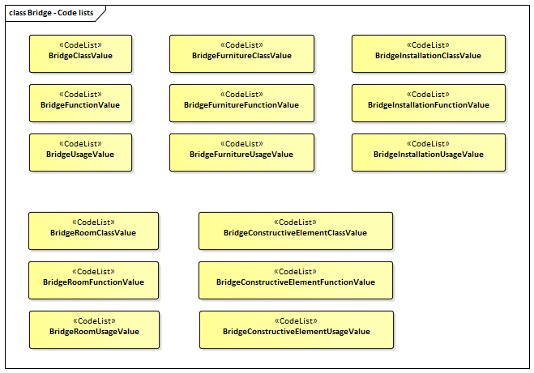
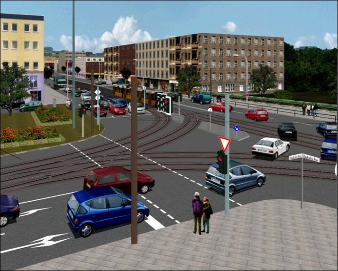

[[ug_model_transportation_section]]
=== Transportation

|===
^|*Contributors*
|C. Heazel - first draft
|===

[[ug_transportation_synopsis_section]]
==== Synopsis

The Transportation module defines central elements of the traffic infrastructure. This includes the transportation classes `road`, `square`, and `track` for the movement of vehicles, bicycles, and pedestrians, the transportation class `railway` for the movement of wheeled vehicles on rails, as well as the transportation class `waterway` for the movement of vessels upon or within water bodies.

[[ug_transportation_concepts_section]]
==== Key Concepts

[[railway-concept]]
**Railway**: Railway represents routes that are utilized by rail vehicles like trams or trains. +
A type of <<abstract-transportation-space-concept,AbstractTransportationSpace>>.

[[road-concept]]
**Road**: Road is intended to be used to represent transportation features that are mainly used by vehicles like cars, for example streets, motorways, and country roads. 
A type of <<abstract-transportation-space-concept,AbstractTransportationSpace>>.

[[square-concept]]
**Square**: A Square is an open area commonly found in cities (e.g. a plaza, market square).
A type of <<abstract-transportation-space-concept,AbstractTransportationSpace>>.

[[track-concept]]
**Track**: A Track is a small path mainly used by pedestrians. 
A type of <<abstract-transportation-space-concept,AbstractTransportationSpace>>.

[[waterway-concept]]
**Waterway**: A Waterway is a transportation space used for the movement of vessels upon or within a water body.
A type of <<abstract-transportation-space-concept,AbstractTransportationSpace>>.

[[abstract-transporation-space-concept]]
**Abstract Transportation Space**: AbstractTransportationSpace defines the properties and associated concepts which are common to Tracks, Roads, Railways, Squares, and Waterways. The associated concepts include: 
A type of <<abstract-unoccupied-space-concept,AbstractUnoccupiedSpace>>.

[[traffic-space-concept]]
* **Traffic Space**: A TrafficSpace is a space in which traffic (transportation) takes place. This is more than a geometry. It includes properties which may of of interest to anyone who wishes to traverse this space. This includes properties such as overhead clearance, surface type, and direction of travel.
A type of <<abstract-unoccupied-space-concept,AbstractUnoccupiedSpace>>.

[[markings-concept]]
* **Markings**: A Marking is a visible pattern on a transportation area relevant to the structuring or restriction of traffic. Examples are road markings and markings related to railway or waterway traffic.
A type of <<abstract-thematic-surface-concept,AbstractThematicSurface>>.

[[hole-concept]]
* **Hole**: A Hole is an opening in the surface of a Road, Track or Square such as road damages, manholes or drains. Holes can span multiple transportation objects.
A type of <<abstract-unoccupied-space-concept,AbstractUnoccupiedSpace>>.

[[auxillary-traffic-space-concept]]
* **Auxillary Traffic Space**: a space within the transportation space not intended for traffic purposes.
A type of <<abstract-unoccupied-space-concept,AbstractUnoccupiedSpace>>.

[[ug_transportation_discussion_section]]
==== Discussion

The transportation model of CityGML is a multi-functional, multi-scale model focusing on thematic and functional as well as on geometrical/topological aspects. Transportation features are represented as a linear network in LOD0. Starting from LOD1, all transportation features are geometrically described by 3D surfaces. The areal modelling of transportation features allows for the application of geometric route planning algorithms. This can be useful to determine restrictions and manoeuvres required along a transportation route. This information can also be employed for trajectory planning of mobile robots in the real world or the automatic placement of avatars (virtual people) or vehicle models in 3D visualisations and training simulators. 

The main class is <<abstract-transporation-space-concept,AbstractTransportationSpace>>, which represents, for example, a road, a track, a railway, a waterway, or a square. <<figure-57>> illustrates the different transportation classes.

NOTE: Need to add a waterway to figure 57.

[[figure-57,Figure {counter:figure-num}]]
.Transportation classes (from left to right: examples of road, track, rail, waterway, and square) (source: Rheinmetall Defence Electronics)
image::figures/inwork/Figure_57_4.jpg[align="center"]

Two major concepts associated with all transportation classes are Traffic Space and Auxillary Traffic Space. Traffic Space describes the space that traffic can traverse. Auxillary Traffic Spaces are associated spaces where traffic does not traverse. 

<<figure-58>> depicts an example for a LOD2 Transportation Space configuration within a virtual 3D city model. The Road consists of several Traffic Spaces for the sidewalks, road lanes, parking lots, and of Auxiliary Traffic Spaces below the raised flower beds.

[[figure-58],Figure {counter:figure-num}]
.Example LOD2 Traffic Spaces in CityGML: a road, which is the aggregation of TrafficAreas and AuxiliaryTrafficAreas (source: City of Solingen, IGG Uni Bonn)

The road itself is represented as a Road object with associated TrafficSpaces and AuxiliaryTrafficSpaces. The TrafficSpaces are those elements which are important in terms of traffic usage such as car driving lanes, pedestrian zones, and cycle lanes. The AuxiliaryTrafficSpaces describe further elements of the road like kerbstones, middle lanes, and green areas.

[[ug_transportation_lod_section]]
==== Level of Detail

The geometrical representation of the Transportation objects varies through the different levels of detail. 

In the coarsest LOD0 the transportation objects are modelled by line objects establishing a linear network. On this abstract level, path finding algorithms or similar analyses can be executed. It also can be used to generate schematic drawings and visualisations of the transport network. Since this abstract definition of transportation network does not contain explicit descriptions of the transportation objects, it may be task of the viewer application to generate the graphical visualisation, for example by using a library with style-definitions (width, color resp. texture) for each transportation object.

Starting from LOD1 a Transportation object provides an explicit surface geometry. This geometry reflects the actual shape of the object, not just its centerline. In LOD2 to LOD3, the object is further subdivided thematically into Traffic Spaces, which are used by transportation, such as cars, trains, public transport, airplanes, bicycles or pedestrians and into Auxiliary Traffic Spaces, which are of minor importance for transportation purposes. The different representations of a Transportation objects for each LOD are illustrated in <<figure-60>>.

[[figure-60,Figure {counter:figure-num}]]
image::figures/inwork/Figure_60_1.png[align="center"]
.Transportation Concepts in LOD0, 1, and 2-3 (example shows part of a motorway) (source: Rheinmetall Defence Electronics).
image::figures/inwork/Figure_60_2.png[align="center"]

In LOD0 areal transportation objects, like squares, should be modeled in the same way as in GDF. GDF is the ISO standard for transportation networks and is used in most car navigation systems. In GDF a square is typically represented as a ring surrounding the place and to which the incident roads connect. CityGML does not cover further functional aspects of transportation network models (e.g. speed limits) as it is intended to complement and not replace existing standards like GDF. However, if specific functional aspects have to be associated with CityGML transportation objects, generic attributes provided by CityGML’s <<ug_model_generics_section,Generics>> module can be used.

Moreover, further objects of interest can be added from other information systems by the use of <<external-references-section,ExternalReferences>>. For example, GDF datasets, which provide additional information for car navigation, can be used for simulation and visualisation of traffic flows. The values of the object attributes can be augmented or replaced by the use of <<codelists-section,CodeLists>> or <<ade-section,ADEs>>. These extensions may be country or user-specific (especially for country-specific road signs and signals).

[[figure-61,Figure {counter:figure-num}]]
.TransportationComplex in LOD 2-3: representation of a road with a complex cross-section profile (example shows urban road) (source: Rheinmetall Defence Electronics).
image::figures/Figure_61.png[align="center"]

[[ug_transportation_uml_section]]
==== UML Model

The UML diagram of the Transportation module is depicted in <<transportation-uml>>.

[[transportation-uml]]
.UML diagram of the Transportation Model.

image::../standard/figures/Transportation.png[align="center"]

The ADE data types provided for the Transportation module are illustrated in <<transportation-uml-ade-types>>.

[[transportation-uml-ade-types]]
.ADE classes of the CityGML Transportation module.
image::../standard/figures/Transportation-ADE_Datatypes.png[align="center"]

The Code Lists provided for the Transportation module are illustrated in <<transportation-uml-codelists>>.

[[transportation-uml-codelists]]
.Codelists from the CityGML Transportation module.

[[ug_transportation_examples_section]]
==== Examples

[#abstracttransportation_semantics,reftext='{table-caption} {counter:table-num}']
.Examples of TrafficArea
[width="90%",cols="^4,^4,^4",options="header"]
|===
|**Example**
|**Country Road**
|**Motorway Entry**
|TransportationComplex – Function
|road
|road
|TrafficArea – Usage
|car, truck, bus, taxi, motorcycle
|car, truck, bus, taxi, motorcycle
|TrafficArea – Function
|driving lane
|motorway_entry
|TrafficArea – SurfaceMaterial
|asphalt
|concrete
|===

The following example shows a complex urban crossing. The picture on the left is a screenshot of an editor application for a training simulator, which allows the definition of road networks consisting of transportation objects, external references, buildings and vegetation objects. On the right, the 3D representation of the defined crossing is shown including all referenced static and dynamic models.

[[figure-62]]
image::figures/inwork/Figure_62_a.png[align="center"]
.Complex urban intersection (left: linear transportation network with surface descriptions and external references, right: generated scene) (source: Rheinmetall Defence Electronics).

