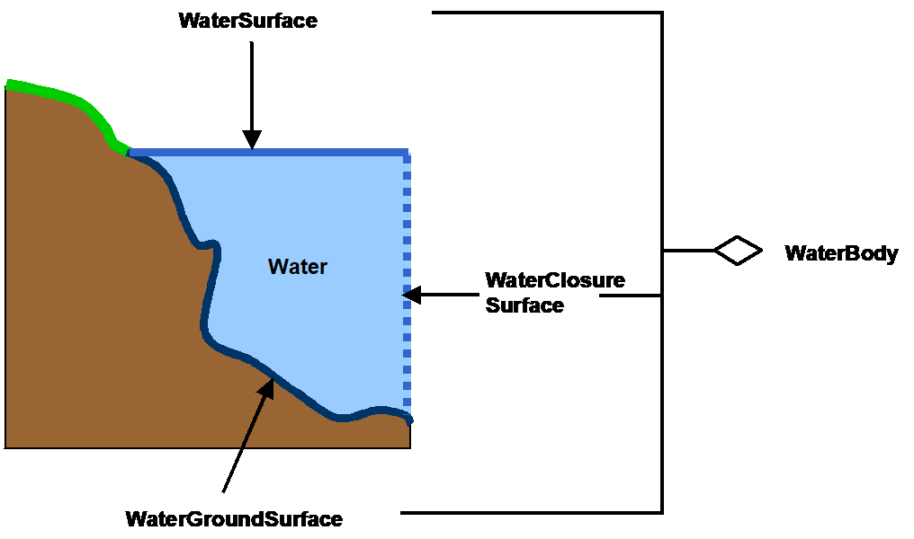
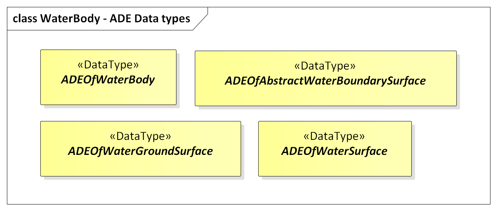
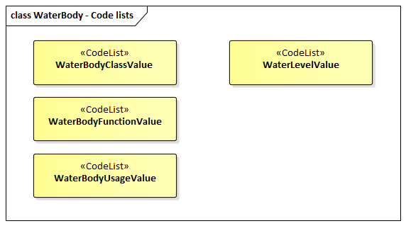

[[ug_model_waterbody_section]]
=== Waterbodies

|===
^|*Contributors*
|C. Heazel - first draft
|===

[[ug_waterbody_synopsis_section]]
==== Synopsis

The WaterBody module provides the representation of significant and permanent or semi-permanent accumulations of surface water, usually covering a part of the Earth. Examples of such water bodies that can be modelled with CityGML are rivers, canals, lakes, and basins.

[[ug_waterbody_concepts_section]]
==== Key Concepts

[[water-body-concept]]
**Waterbody**: A WaterBody represents significant and permanent or semi-permanent accumulations of surface water, usually covering a part of the Earth.

[[water-surface-concept]]
**Water Surface**: A WaterSurface represents the upper exterior interface between a water body and the atmosphere. Water Surface is a boundary property of a Water Body.

[[water-ground-surface-concept]]
**Water Ground Surface**: A WaterGroundSurface represents the exterior boundary surface of the submerged bottom of a water body. Water Ground Surface is a boundary property of a Water Body.

[[ug_waterbody_discussion_section]]
==== Discussion

Waters have always played an important role in urbanisation processes and cities were built preferably at rivers and places where landfall seemed to be easy. Obviously, water is essential for human alimentation and sanitation. Water bodies present the most economical way of transportation and are barriers at the same time, that avoid instant access to other locations. Bridging waterways caused the first efforts of construction and resulted in high-tech bridges of today. The landscapes of many cities are dominated by water, which directly relates to 3D city models. Furthermore, water bodies are important for urban life as subject of recreation and possible hazards as e.g. floods.

The distinct character of water bodies compared with the permanence of buildings, roadways, and terrain is considered in this thematic model. Water bodies are dynamic surfaces. Tides occur regularly, but irregular events predominate with respect to natural forces, for example flood events. The visible water surface changes in height and its covered area with the necessity to model its semantics and geometry distinct from adjacent objects like terrain or buildings.

This first modelling approach of water bodies fulfils the requirements of 3D city models. It does not inherit any hydrological or other dynamic aspects. In these terms it does not claim to be complete. However, the semantic and geometric description given here allows further enhancements of dynamics and conceptually different descriptions. The water bodies model of CityGML is embraced by the extension module WaterBody.

The water bodies model represents the thematic aspects and three-dimensional geometry of rivers, canals, lakes, and basins. In the LOD 1-3 water bodies are bounded by distinct thematic surfaces (see <<figure-55>>). These surfaces are the obligatory WaterSurface, defined as the boundary between water and air, and the optional WaterGroundSurface, defined as the boundary between water and underground (e.g. DTM or floor of a 3D basin object). 

[[figure-55]]
.Illustration of a water body defined in CityGML (graphic: IGG Uni Bonn).

. Boundary class “Air to Water”. The <<water-surface-concept,WaterSurface>> is mandatory to the model and usually is registered using photogrammetric analysis or mapping exploration. The representation may vary due to tidal flats or changing water levels, which can be reflected by including different static water surfaces having different waterLevels, as for example highest flooding event, mean sea level, or minimum water level. This offers the opportunity to describe significant water surfaces due to levels that are important for certain representations e.g. in tidal zones.
. Boundary class “Water to Ground”. The <<water-ground-surface-concept,WaterGroundSurface>> may be known by sonar exploration or other depth measurements. The <<water-surface-concept,WaterSurface>> objects together with the <<water-ground-surface-concept,WaterGroundSurface>> objects enclose the <<water-body-concept,WaterBody>> as a volume.

[[ug_waterbody_lod_section]]
==== Level of Detail

Both LOD0 and LOD1 represent a low level of illustration and high grade of generalisation. Here the rivers are modelled as <<GM_MultiCurve-section,GM_MultiCurve>> geometry and brooks are omitted. Seas, oceans and lakes with significant extent are represented as a <<GM_MultiSurface-section,GM_MultiSurface>> (<<figure-56>>). Every WaterBody may be assigned a combination of geometries of different types. Linear water bodies are represented as a network of 3D curves. Each curve is composed of straight line segments, where the line orientation denotes the flow direction (water flows from the first point of a curve to the last). Areal objects like lakes or seas are represented by 3D surface geometries of the water surface.

Starting from LOD1 water bodies may also be modelled as water filled volumes represented by <<GM_Solid-section,GM_Solids>>. If a water body is represented by a <<GM_Solid-section,GM_Solids>> in LOD2 or higher, the surface geometries of the corresponding thematic <<water-ground-surface-concept,WaterGroundSurface>>, and <<water-surface-concept,WaterSurface>> objects must coincide with the exterior shell of the <<GM_Solid-section,GM_Solid>>. This can be ensured, if for each LOD X the respective lodXSolid representation (where X is between 2 and 3) does not redundantly define the geometry, but instead references the corresponding polygons of the lodXSurface elements (where X is between 2 and 3) of <<water-ground-surface-concept,WaterGroundSurface>> and <<water-surface-concept,WaterSurface>>.

LOD2 to LOD3 demand a higher grade of detail and therefore any <<water-body-concept,WaterBody>> can be outlined by <<thematic-surface-concept,thematic surfaces> or a solid composed of the surrounding <<thematic-surface-concept,thematic surfaces>.

Every object of the class <<water-surface-concept,WaterSurface>> and <<water-ground-surface-concept,WaterGroundSurface>> must have at least one associated surface geometry. This means, that every WaterSurface and WaterGroundSurface feature within a CityGML instance document must contain at least one of the following properties: lod1MultiSurface, lod2MultiSurface, lod3MultiSurface.

The water body model implicitly includes the concept of <<terrain-intersection-curve-concept,TerrainIntersectionCurves>> (TIC), e.g. to specify the exact intersection of the DTM with the 3D geometry of a WaterBody or to adjust a WaterBody or WaterSurface to the surrounding DTM. The rings defining the WaterSurface polygons implicitly delineate the intersection of the water body with the terrain or basin.

[[ug_waterbody_uml_section]]
==== UML Model

The UML diagram of the water body model is depicted in <<waterbody-uml>>. Each WaterBody object may have the attributes `class`, `function` and `usage` whose possible values can be enumerated in code lists. The attribute `class` defines the classification of the object, e.g. lake, river, or fountain and can occur only once. The attribute `function` contains the purpose of the object like, for example national waterway or public swimming, while the attribute `usage` defines the actual usages, e.g. whether the water body is navigable. The latter two attributes can occur multiple times.

Since WaterBody is a subclass of <<abstract-occupied-space-concept,AbstractOccupiedSpace>> and hence a feature, it inherits the attribute `name` from the <<abstract-feature-concept,AbstractFeature>> class. The WaterBody can be differentiated semantically by the class <<abstract-water-boundary-class-concept,AbstractWaterBoundarySurface>>. A <<abstract-water-boundary-class-concept,AbstractWaterBoundarySurface>> is a part of the water body’s exterior shell with a special function like WaterSurface or WaterGroundSurface. As with any <<abstract-city-object-concept,CityObject>>, WaterBody objects as well as WaterSurface and WaterGroundSurface may be assigned <<external-reference-concept,ExternalReferences>> and may be augmented by generic attributes using CityGML’s Generics module (see <<ug_model_generics_section>>).

The optional attribute `waterLevel` of a WaterSurface can be used to describe the water level, for which the given 3D surface geometry was acquired. This is especially important when the water body is influenced by the tide. The allowed values can be defined in a corresponding code list.

[[waterbody-uml]]
.UML diagram of the Water Body Model.

image::../standard/figures/WaterBody.png[align="center"]

The ADE data types provided for the Water Body module are illustrated in <<waterbody-uml-ade-types>>.

[[waterbody-uml-ade-types]]
.ADE classes of the CityGML Water Body module.

The Code Lists provided for the Water Body module are illustrated in <<waterbody-uml-codelists>>.

[[waterbody-uml-codelists]]
.Codelists from the CityGML Water Body module.

[[ug_waterbody_examples_section]]
==== Examples

