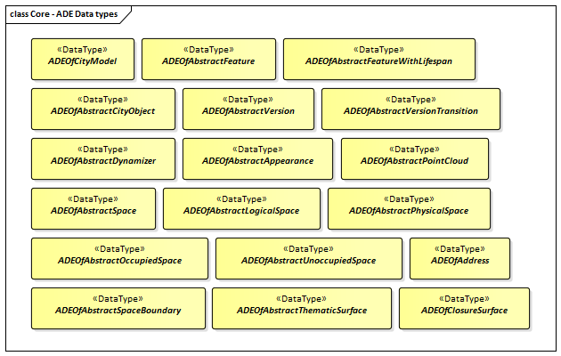

:sectnums:

[[ug-model-core-section]]
=== Core

|===
^|*Contributors*
|C. Heazel - first draft
|===

The CityGML Core module defines the basic concepts and components of city models. This rather large body of work is divided into seven sections. These sections build on each other from the fundamental principles specified by the relevant ISO standards up to the full CityGML model. These sections are summarized in <<citygml-core-table>>.

[[citygml-core-table,Table {counter:table-num}]]
.CityGML Core Sections
[width="90%",cols="2.^,6.^"]
|===
|<<ug-key-concepts-section,Key Concepts>> |Summarizes the key concepts described in the Core module.
|<<ug-iso-dependencies-section,The Use of ISO Standards>> |Describes the use of the ISO 19100 series of International Standards to provide a foundation to the CityGML model.
|<<ug-city-objects-section,City Models and City Objects>>|Defines the basic building blocks of the CityGML model.
|<<ug-space-concepts-section,Space Concept>>|Defines the concepts of space as used in the CityGML model.
|<<ug-geometry-lod-section,Geometry and LOD>>|Defines the geometry and Levels Of Detail concepts.
|<<ug-core-uml-section,CityGML Core Model>>|Presents the complete Core model.
|<<ug-core-b-e-c-section,Types, Enumerations, and Codelist>> |Defines the little things which make this model work.
|===

[[ug-key-concepts-section]]
==== Key Concepts

The following is a summary of the key concepts described by the Core Module. This is not an exaustive listing of all of the Core concepts. Rather, it is an introduction those concepts which are essentiall for understanding the role of the Core Module in the CityGML Conceptual Model. 

NOTE: Each entry sould include a link to the section which provides the next level of detail. Clicking on the concept name will take you to the data dictionary. A (see also) link will take you to more discussion.

[[city-model-concept]]
<<CityModel-section,*CityModel*>>: The CityModel class is the root class of every CityGML conceptual model. It's primary purpose is to aggregate CityModelMembers.

[[city-model-member-concept]]
<<CityModelMember-section,*CityModelMember*>>: CityModelMember is a Union of all possible classes which can be included in a city model. Those classes are summarized in <<city-model-member-table>>.  

[[city-model-member-table,Table {counter:table-num}]]
.City Model Members
[cols="2,6"]
|===
|<<abstract-appearance-concept,AbstractAppearance>>|Rules for rending the associated objects
|<<abstract-city-object-concept,AbstractCityObject>>|Physical objects with a location and geometry 
|<<abstract-feature-concept,AbstractFeature>>|Others
|<<abstract-version-concept,AbstractVersion>>|Version information
|<<abstract-version-transition-concept,AbstractVersionTransition>>|Version information
|===

[[abstract-feature-concept]]
<<AbstractFeature-section,*AbstractFeature*>>: AbstractFeature is a subclass of the AnyFeature class from the ISO General Feature Model. Every &#171;FeatureType&#187; class in a CityGML model is descended from this class. `AbstractFeature` also defines identifying attributes which are common across the model. Finally, `AbstractFeature` allows an <<ug-ade-section,ADE>> to be associated with any &#171;FeatureType&#187; class.  

[[abstract-feature-with-lifespan-concept]]
<<AbstractFeatureWithLifespan-section,*AbstractFeatureWithLifespan*>>: This class extends <<abstract-feature-concept,AbstractFeature>> with temporal properties for the classes. Most Feature classes in the CityGML model are descended from this class. As such they contain the following attributes:

* featureId
* identifier
* name
* description
* creationDate
* terminationDate
* validFrom
* validTo
* adeOfAbstractFeatureWithLifespan

[[abstract-appearance-concept]]
<<AbstractAppearace-section,*AbstractAppearance*>>: The root class for all classes related to the rendering of the model including textures and materials.

[[abstract-version-concept]]
<<AbstractVersion-section,*AbstractVersion*>>: a defined state of a city model consisting of the dedicated versions of all city object instances that belong to the respective city model version.

[[abstract-version-transition-concept]]
<<AbstractVersionTransition-section,*AbstractVersionTransition*>>: describes the change of the state of a city model from one version to another.

[[abstract-city-object-concept]]
<<AbstractCityObject-section,*AbstractCityObject*>>: The superclass of all thematic classes within the CityGML conceptual model. Significant subclasses of `AbstractCityObject` are <<abstract-space-concept,AbstractSpace>> and <<abstract-space-boundary-concept,AbstractSpaceBoundary>>. These subclasses provide CityGML objects with location, geometry and boundary properties.

[[abstract-space-concept]]
<<AbstractSpace-setion,*AbstractSpace*>>: Classes which have a volumetric extent in the real world.

[[abstract-occupied-space-concept]]
<<AbstractOccupiedSpace-section,*AbstractOccupiedSpace*>>: Classes which describe <<abstract-space-concept,spaces>> that are partially or entirely filled with matter.

[[abstract-unoccupied-space-concept]]
<<AbstractUnoccupiedSpace-section,*AbstractUnccupiedSpace*>>: Classes which describe <<abstract-space-concept,spaces>> that are entirely or mostly free of matter.

[[abstract-logical-space-concept]]
<<AbstractLogicalSpace-section,*AbstractLogicalSpace*>>: Classes which describe <<abstract-space-concept,spaces>> that are not bounded by physical surfaces but are defined according to thematic considerations.

[[abstract-space-boundary-concept]]
<<AbstractSpaceBoundary-section,*AbstractSpaceBoundary*>>: Classes which bound a space.

[[abstract-thematic-surface-concept]]
<<AbstractThematicSurface-section,*AbstractThematicSurface*>>: The superclass for all thematic surfaces. A type of <<abstract-space-boundary-concept,Space Boundary>>.

[[implicit-geometry-concept]]
<<ImplicitGeometry-section,*ImplicitGeometry*>>: A geometry representation where the shape is stored only once as a prototypical geometry, for example a tree or other vegetation object, a traffic light or a traffic sign. This prototypic geometry object can be re-used or referenced many times, wherever the corresponding feature occurs in the 3D city model. A type of <<abstract-feature-concept,Abstract Feature>>.

[[ug-iso-dependencies-section]]
==== ISO Dependencies

CityGML builds on the ISO 19100 family of standards. The applicable standards are identified in <<ISO-in-CityGML-diagram>>. A <<ISO-classes-dd,Data dictionary>> is also included for all of the ISO-defined classes explicitly referenced in the CityGML UML model. These data dictionaries are provided for the convenience of the user. The ISO standards are the normative source.

[[ISO-in-CityGML-diagram,Figure {counter:figure-num}]]
.Use of ISO Standards in CityGML
image::../standard/figures/Core/ISOandOASISstandardsinCityGML.png[align="center"]

[[ug-iso-classes-section]]
*Classes*

The ISO classes explicitly used in the CityGML UML model are introduced in <<iso-class-table>>. Detailed descriptions are provided in the  <<ISO-classes-dd,Data Dictionary>>.

[[iso-class-table,Table {counter:table-num}]]
.ISO Classes used in CityGML
[cols="2,6",options="headers"]
|===
^|*Class Name* ^|*Description*
|<<AnyFeature-section,AnyFeature>> |[[anyfeature-concept]] A generalization of all feature types
|<<CV_DiscreteGridPointCoverage-section,CV_DiscreteGridPointCoverage>> |[[cv_discrete-grid-point-coverage-concept]]A coverage that returns the same feature attribute values for every direct position within any object in its domain.
|<<DirectPosition-section,DirectPosition>> |[[direct-position-concept]]The coordinates for a position within some coordinate reference system.
|<<GM_Object-section,GM_Object>> |[[gm_object-concept]]The root class of the geometric object taxonomy.
|<<GM_MultiCurve-section,GM_MultiCurve>> |[[gm_curve-concept]]An aggregate class containing only instances of GM_OrientableCurve.
|<<GM_MultiPoint-section,GM_MultiPoint>> |[[gm_multipoint-concept]]An aggregate class containing only points.
|<<GM_MultiSurface-section,GM_MultiSurface>> |[[gm_multisurface-concept]]An aggregate class containing only instances of GM_OrientableSurface.
|<<GM_Point-section,GM_Point>> |[[gm_point-concept]]The basic data type for a geometric object consisting of one and only one point.
|<<GM_Solid-section,GM_Solid>> |[[gm_solid-concept]]The basis for 3-dimensional geometry. The extent of a solid is defined by the boundary surfaces.
|<<GM_Surface-section,GM_Surface>> |[[gm_surface-concept]]The basis for 2-dimensional geometry.
|<<GM_Tin-section,GM_Tin>> |[[gm_tin-concept]]A GM_TriangulatedSurface which uses the Delaunay or similar algorithm.
|<<GM_TriangulatedSurface-section,GM_TriangulatedSurface>> [[gm_triangulated-surface-concept]]|A GM_PolyhedralSurface that is composed only of triangles
|<<SC_CRS-section,SC_CRS>> |[[sc_crs-concept]]Coordinate reference system which is usually single but may be compound.
|<<TM_Position-section,TM_Position>> |[[tm_position-concept]]A union class that consists of one of the data types listed as its attributes.
|===

[[ug-iso-geometry-section]]
*Geometry*

The most common geometry concept found in the CityGML 3.0 Standard is the concept of <<ug-gm_multiprimitive-section,multi-primitives>>. These are homogeneous collections of <<ug-gm_primitive-section,GM_Primitives>> which are aggregated to form a more compex geometry. 

<<ug-gm_composite-section,GM_Composites>> are another form of <<ug-gm_primitive-section,GM_Primitive>> collection. These differ from <<ug-gm_multiprimitive-section,GM_MultiPrimitive>> in that the collection can be heterogeneous. It should be  noted that none of the classes in the CityGML 3.0 Standard are decended from <<ug-gm_composite-section,GM_Composites>>. However, the terms "CompositeCurve", "CompositeSurface", and "CompositeSolid" do appear in the text. The `composit` concept can also be seen in the assocation between spaces and surfaces. Therefore, an explanation of `composits` has been included for completeness.

[[ug-gm_primitive-section]]
===== GM_Primitive

GM_Primitive is the abstract root class of the geometric primitives. Its main purpose is to define the basic "boundary" operation that ties the primitives in each dimension together. A geometric primitive (GM_Primitive) is a geometric object that is not decomposed further into other primitives in the system. This includes curves and surfaces, even though they are composed of curve segments and surface patches, respectively. This composition is a strong aggregation: curve segments and surface patches cannot exist outside the context of a primitive.

NOTE Most geometric primitives are decomposable infinitely many times. Adding a centre point to a line may split that line into two separate lines. A new curve drawn across a surface may divide that surface into two parts, each of which is a surface. This is the reason that the normal definition of primitive as "non-decomposable" is not plausible in a geometry model - the only non-decomposable object in geometry is a point.

[[ug-gm_multiprimitive-section]]
===== GM_MultiPrimitive

Any geometric object that is used to describe a feature is a collection of <<ug-gm_primitive-section,geometric primitives>>. A homogeneous collection of geometric primitives may be a multi-primitive (GM_MultiPrimitive). Geometric complexes have additional properties specific to the type of <<ug-gm_primitive-section,geometric primitive>> they aggregate.

[[gm_aggregate-figure,Figure {counter:figure-num}]]
.GM_MultiPrimitive Context Diagram

[[ug-gm_complex-section]]
===== GM_Complex

A GM_Complex is a set of disjoint geometric primitives (<<ug-gm_primitive-section,GM_Primitive>>) such that the boundary of each primitive can be represented as the union of other geometric primitives within the complex.

Any geometric object that is used to describe a feature is a collection of <<ug-gm_primitive-section,geometric primitives>>. A collection of geometric primitives may be a geometric complex (GM_Complex). Geometric complexes have additional properties such as closure by boundary operations and mutually exclusive component parts.

[[gm_complex-figure,Figure {counter:figure-num}]]
.GM_Complex Context Diagram

<<ug-gm_primitive-section,GM_Primitive>> and GM_Complex share most semantics, in the meaning of operations, attributes and associations. There is an exception in that a GM_Primitive shall not contain its boundary (except in the trivial case of GM_Point where the boundary is empty), while a GM_Complex shall contain its boundary in all cases. This means that if an instantiated object implements GM_Object operations both as GM_Primitive and as a GM_Complex, the semantics of each set theoretic operation is determined by the its name resolution. Specifically, for a particular object such as GM_CompositeCurve, GM_Primitive::contains (returns FALSE for end points) is different from GM_Complex::contains (returns TRUE for end points). Further, if that object is cast as a GM_Primitive value and as a GM_Complex value, then the two values need not be equal as GM_Objects.

GM_Complex aggregates GM_Primitives through the `element` property. Since this is an aggregation, the target GM_Primitive may be associated with more than one GM_Complex.

A GM_Complex object can also have a whole/part relationship with other GM_Complex objects. The `contains` association is used to associate the `superComplex` instance with the `subComplex` instance.

Note that the geometric primitives in the set are mutually exclusive in the sense that no point is interior to more than one primitive.  The set is closed under boundary operations, meaning that for each element in the complex, there is a collection (also a complex) of geometric primitives that represents the boundary of that element.

[[ug-gm_composite-section]]
===== GM_Composite

GM_Composite is a subclass of <<ug-gm_complex-section,GM_Complex>>. Like <<ug-gm_complex-section,GM_Complex>>, it has an association with <<ug-gm_primitive-section,GM_Primitives>>. In this case this is an `composition` association with a `composite` role (GM_Composite) and a `generator` role (GM_Primitive). As with the GM_Complex, the GM_Primitve may be associated with more than one GM_Composite.

[[gm_composite-figure,Figure {counter:figure-num}]]
.GM_Composite Context Diagram

===== GM_CompositeSurface

A GM_Composite where the <<ug-gm_primitive-section,GM_Primitives>> is a <<ug-gm_orientable-surface-section,GM_OrientatableSurface>>.

A GM_CompositeSurface is also a subclass of <<ug-gm_primitive-section,GM_Primitives>> is a <<ug-gm_orientable-surface-section,GM_OrientatableSurface>>. One of the few examples of multiple inheritance.

[[gm_composite-surface-figure,Figure {counter:figure-num}]]
.GM_CompositeSurface Context Diagram
image::figures/GM_CompositeSurface.png[align="center"]

[[ug-gm_orientable-surface-section]]
===== GM_OrientatableSurface

GM_OrientableSurface consists of a surface and an orientation inherited from GM_OrientablePrimitive. If the orientation is "+", then the GM_OrientableSurface is a GM_Surface. If the orientation is "-", then the GM_OrientableSurface is a reference to a GM_Surface with an upNormal that reverses the direction for this GM_OrientableSurface, the sense of "the top of the surface" (see 6.4.33.2).

  GM_OrientableSurface: 
  {Orientation = "+" implies primitive = self}; 
  {(Orientation = "-" and TransfiniteSet::contains(p : DirectPosition)) implies (primitive.upNormal(p) = - self.upNormal(p))};

[[ug-gm_composite-curve-section]]  
===== GM_CompositeCurve

A GM_CompositeCurve is a list of geometric curves such that the each geometric curve in the set terminates at the start point of the subsequent curve in the list

The `generator` is a GM_OrientableCurve. 

A GM_CompositCurve is also a subclass of GM_OrientatableCurve. One of the few examples of multiple inheritance.

[[gm_composite-curve-figure,Figure {counter:figure-num}]]
.GM_CompositeCurve Context Diagram

[[ug-gm_orientable-curve-section]]
===== GM_OrientatableCurve

GM_OrientableCurve consists of a curve and an orientation inherited from GM_OrientablePrimitive. If the orientation is "+", then the GM_OrientableCurve is a <<ug-gm_curve-section,GM_Curve>>. If the orientation is "-", then the GM_OrientableCurve is related to another <<ug-gm_curve-section,GM_Curve>> with a parameterization that reverses the sense of the curve traversal.

  GM_OrientableCurve:
  {Orientation = "+" implies primitive = self}; +
  {Orientation = "-" implies primitive.parameterization(length()-s) = parameterization(s)};

[[ug-gm_composite-solid-section]]  
===== GM_CompositeSolid

A GM_CompositeSolid is a set of geometric solids adjoining one another along common boundary geometric surfaces.

The `generator` is a <<ug-gm_solid-section,GM_Solid>>. 

A GM_CompositSolid is also a subclass of <<ug-gm_solid-section,GM_Solid>>. One of the few examples of multiple inheritance.

[[gm_composite-solid-figure,Figure {counter:figure-num}]]
.GM_CompositeSolid Context Diagram

[[ug-city-objects-section]]
==== City Models and City Objects

City models are virtual representations of real-world cities and landscapes. A city model aggregates different types of objects, which can be city objects, appearances, different versions of the city model, transitions between different versions of the city model, and feature objects. All objects defined in the CityGML CM are <<abstract-feature-with-lifespan-concept,features with lifespan>>. This allows the optional specification of the real-world and database times for the existence of each feature, as is required by the Versioning module (cf. <<ug-model-versioning-section>>). Features that define thematic concepts related to cities and landscapes, such as building, bridge, water body, or land use, are referred to as city objects. All city objects define properties that describe the objects in more detail. These static properties can be overridden with time-varying data through Dynamizers (cf. <<ug-model-dynamizer-section>>).

[[city-model-uml-section,Figure {counter:figure-num}]]
.UML City Models and City Objects
image::../standard/figures/Core/Core-City_models_and_city_objects.png[align="center"]

The City Model and City Object classes in the in the <<Core-package-dd,Data Dictionary>>.

The most important concepts for the City Model user to understand are: 

* <<abstract-feature-concept,AbstractFeature>> (provides identifiing properties)
* <<abstract-feature-with-lifespan-concept,AbstractFeatureWithLifespan>> (adds temporal properties)
* <<abstract-thematic-surface-concept,AbstractThematicSurface>> (adds geometry and city context)
* <<abstract-occupied-space-concept,AbstractOccupiedSpace>>
* <<abstract-unoccupied-space-concept,AbstractUnoccupiedSpace>>
* <<abstract-logical-space-concept,AbstractLogicalSpace>>
* <<abstrct-space-boundary-concept,AbstractSpaceBoundary>> (relief)

[[ug-space-concepts-section]]
==== Space Concept

All city objects are differentiated into <<abstract-space-concept,spaces>> and <<abstract-space-boundary-concept,space boundaries>>. 

[[ug-abstract-space-section]]
<<abstract-space-concept,Spaces>> are entities of volumetric extent in the real world. Buildings, water bodies, trees, rooms, and traffic spaces, for instance, have a volumetric extent. Spaces can be classified into physical spaces and logical spaces. Physical spaces, in turn, can be further classified into occupied spaces and unoccupied spaces.

[[abstract-space-boundary-section]]
<<abstract-space-boundary-concept,Space boundaries>>, in contrast, are entities with areal extent in the real world. Space boundaries can be differentiated into different types of thematic surfaces, such as wall surfaces and roof surfaces.

NOTE: add definition of `boundary surface` and introduce B_Rep. (<<Foley2002,Foley et al. 2002>>). 
In short, the solids in CityGML 3.0 can be represented by surfaces which define the boundaries of the associated shape. These `boundary surfaces` are associated with their <<abstract-space-concept,AbstractSpace>> class through the `boundary` association (property).

<<abstract-space-boundary-concept,AbstractSpaceBoundary>> is specialized into <<abstract-thematic-surface-concept,thematic surfaces>>. It is the subclassing of the <<abstract-thematic-surface-concept,thematic surfaces>> which gives semantics to the CityGML surfaces. Note that a <<closure-surface-concept,Closure Surface>> is also a thematic surface. so a solid can be fully B_Rep enclosed even if part of the surface does not physically exist.

Consider that the AbstractSpaceBoundary is a Multi-Surface. So it stands to reason that a `space boundary` is an <<abstract-space-boundary-concept,AbstractSpaceBoundary>> which is composed of one or more `Boundary Surfaces`. Per the B_Rep concept, those `Boundary Surfaces` must completely enclose the Abstract Space. This may include the addition of surfaces both internal (but visible) as well as external. Hence, the distinction between internal and external space is moot. Internal surfaces are just a continuation of the space boundary around the solid. 

<<core-boundaries-table>> lists the surfaces that are allowed as thematic surface boundaries of the space classes defined in the Core module:

[[core-boundaries-table,Table {counter:table-num}]]
.Core space classes and their allowed thematic surface boundaries
[cols="2,6",options="headers"]
|===
^|*Space class* ^|*Allowed space boundaries*
|AbstractLogicalSpace
a| * Core::AbstractSpaceBoundary and the subclasses: +
{nbsp}{nbsp}{nbsp}{nbsp}Core::AbstractThematicSurface, +
{nbsp}{nbsp}{nbsp}{nbsp}Core::ClosureSurface
   * Generics::GenericThematicSurface
   * possible classes from ADEs

|AbstractOccupiedSpace
a| * Core::AbstractSpaceBoundary and the subclasses: +
{nbsp}{nbsp}{nbsp}{nbsp}Core::AbstractThematicSurface, +
{nbsp}{nbsp}{nbsp}{nbsp}Core::ClosureSurface
   * Generics::GenericThematicSurface
   * possible classes from ADEs

|AbstractPhysicalSpace
a| * Core::AbstractSpaceBoundary and the subclasses: +
{nbsp}{nbsp}{nbsp}{nbsp}Core::AbstractThematicSurface, +
{nbsp}{nbsp}{nbsp}{nbsp}Core::ClosureSurface
   * Generics::GenericThematicSurface
   * possible classes from ADEs

|AbstractSpace
a| * Core::AbstractSpaceBoundary and the subclasses: +
{nbsp}{nbsp}{nbsp}{nbsp}Core::AbstractThematicSurface, +
{nbsp}{nbsp}{nbsp}{nbsp}Core::ClosureSurface
   * Generics::GenericThematicSurface
   * possible classes from ADEs

|AbstractUnoccupiedSpace
a| * Core::AbstractSpaceBoundary and the subclasses: +
{nbsp}{nbsp}{nbsp}{nbsp}Core::AbstractThematicSurface, +
{nbsp}{nbsp}{nbsp}{nbsp}Core::ClosureSurface
   * Generics::GenericThematicSurface
   * possible classes from ADEs
|===

A detailed introduction to the Space concept can be found in <<space-and-space-boundaries-section>>. 

In particular, the classification into OccupiedSpace and UnoccupiedSpace might not always be apparent at first sight. Carports, for instance, represent an OccupiedSpace, although they are not closed and most of the space is free of matter, see <<figure-carport>>. Since a carport is a roofed, immovable structure with the purpose of providing shelter to objects (i.e. cars), carports are frequently represented as buildings in cadastres. Thus, also in CityGML, a carport should be modelled as an instance of the class Building. Since Building is transitively a subclass of OccupiedSpace, a carport is an OccupiedSpace as well. However, only in LOD1, the entire volumetric region covered by the carport would be considered as physically occupied. In LOD1, the occupied space is defined by the entire carport solid (unless a room would be defined in LOD1 that would model the unoccupied part below the roof); whereas in LOD2 and LOD3, the solids represent more realistically the really physically occupied space of the carport. In addition, for all OccupiedSpaces, the normal vectors of the thematic surfaces like the RoofSurface need to point away from the solids, i.e. consistent with the solid geometry.

[[figure-carport,Figure {counter:figure-num}]]
.Representation of a carport as OccupiedSpace in different LODs. The red boxes represent solids, the green area represents a surface. In addition, the normal vectors of the roof solid (in red) and the roof surface (in green) are shown.
image::../standard/images/carport.png[align="center"]

In contrast, a room is a physically unoccupied space. In CityGML, a room is represented by the class BuildingRoom that is a subclass of UnoccupiedSpace. In LOD1, the entire room solid would be considered as unoccupied space, which can contain furniture and installations, though, as is shown in <<figure-room>>. In LOD2 and 3, the solid represents more realistically the really physically unoccupied space of the room (possibly somewhat generalized as indicated in the figure). For all UnoccupiedSpaces, the normal vectors of the bounding thematic surfaces like the InteriorWallSurface need to point inside the object, i.e. opposite to the solid geometry.

[[figure-room,Figure {counter:figure-num}]]
.Representation of a room as UnoccupiedSpace in different LODs. The red boxes represent solids, the green area represents a surface. In addition, the normal vectors of the room solid (in red) and the wall surface (in green) are shown.
image::../standard/images/room.png[align="center"]

The UML diagram of the Space concept classes is depicted in <<core-spaceconcept>>.

[[core-spaceconcept,Figure {counter:figure-num}]]]
.UML Space Concepts
image::../standard/figures/Core/Core-Space_concepts.png[align="center"]

The Space Concept classes defined in the CityGML UML model are documented in the <<data-dictionary-core,Data Dictionary>>.

[[ug-geometry-lod-section]]
==== Geometry and LOD

Spaces and space boundaries can have various geometry representations depending on the Levels of Detail (LOD). Spaces can be spatially represented as single points in LOD0, multi-surfaces in LOD0/2/3, solids in LOD1/2/3, and multi-curves in LOD2/3. Space boundaries can be represented as multi-surfaces in LOD0/2/3 and as multi-curves in LOD2/3. All Levels of Detail allow for the representation of the interior of city objects.

The different Levels of Detail are defined in the following way:

* LOD 0: Volumetric real-world objects (Spaces) can be spatially represented by a single point, by a set of curves, or by a set of surfaces. Areal real-world objects (Space Boundaries) can be spatially represented in LOD0 by a set of curves or a set of surfaces. LOD0 surface representations are typically the result of a projection of the shape of a volumetric object onto a plane parallel to the ground, hence, representing a footprint (e.g. a building footprint or a floor plan of the rooms inside a building). LOD0 curve representations are either the result of a projection of the shape of a vertical surface (e.g. a wall surface) onto a grounding plane or the skeleton of a volumetric shape of longitudinal extent such as a road or river segment.
* LOD 1: Volumetric real-world objects (Spaces) are spatially represented by a vertical extrusion solid, i.e. a solid created from a horizontal footprint by vertical extrusion. Areal real-world objects (Space Boundaries) can be spatially represented in LOD1 by a set of horizontal or vertical surfaces.
* LOD 2: Volumetric real-world objects (Spaces) can be spatially represented by a set of curves, a set of surfaces, or a single solid geometry. Areal real-world objects (Space Boundaries) can be spatially represented in LOD2 by a set of surfaces. The shape of the real-world object is generalized in LOD2 and smaller details (e.g. bulges, dents, sills, but also structures like e.g. balconies or dormers of buildings) are typically neglected. LOD2 curve representations are skeletons of volumetric shapes of longitudinal extent like an antenna or a chimney.
* LOD 3: Volumetric real-world objects (Spaces) can be spatially represented by a set of curves, a set of surfaces, or a single solid geometry. Areal real-world objects (Space Boundaries) can be spatially represented in LOD3 by a set of surfaces. LOD3 is the highest level of detail and respective geometries include all available shape details.

In addition, the geometry can also be represented implicitly. The shape is stored only once as a prototypical geometry, which then is re-used or referenced, wherever the corresponding feature occurs in the 3D city model.

The thematic classes, such as building, tunnel, road, land use, water body, or city furniture are defined as subclasses of the space and space boundary classes within the thematic modules. Since all city objects in the thematic modules represent subclasses of the space and space boundary classes, they automatically inherit the geometries defined in the Core module.

The UML diagram of the Geometry and LoD concept classes is depicted in <<core-geometry>>.

[[core-geometry,Figure {counter:figure-num}]]
.UML Geometry and LOD Concepts
image::../standard/figures/Core/Core-Geometry_and_LoD_concept.png[align="center"]

The Geometry and LOD Concept classes defined in the CityGML UML model and documented in the <<data-dictionary-core,Data Dictionary>>.

Of particular note is the Implicit Geometry concept. Many of the objects encountered in a city landscape have the same geometry. How many types of street lamps can there be? An Implicit Geometry captures that geometry once, and re-uses that one geometry for all similar street lamp objects.

[[ug-core-uml-section]]
==== CityGML Core UML Model

The <<city-objects-section,City Model and City Object>> classes, the <<space-concepts-section,Space Concept>> classes, and the <<geometry-lod-section,Geometry and LOD>> classes define the majority of the CityGML Core module. In addition to these concepts, the Core module also specifies that city objects can have relations to other city objects and that they can have address information. All other modules defined in the CityGML model refer to the Core module.

The UML diagram of the complete Core module is depicted in <<core-uml>>.

[[core-uml,Figure {counter:figure-num}]]
.UML diagram of CityGML’s core module.
image::../standard/figures/Core/Core-Overview.png[align="center"]

The most important of the Core classes have been introduce already in the <<core-key-concepts-section,Key Concepts>> Section. More details about these classes can be found in the <<data-dictionary-core,Data Dictionary>>.

[[ug-core-b-e-c-section]]
==== Data types, Enumerations, and Code lists

The ADE data types provided for in the Core module are illustrated in <<core-uml-ade-types>>.

[[core-uml-ade-types,Figure {counter:figure-num}]]
.ADE classes of the CityGML Core module.

The Data Types, Basic Types, Enumerations, Unions, and Code Lists provided for the Core module are illustrated in <<core-uml-codelists>>.

[[core-uml-codelists,Figure {counter:figure-num}]]
.Basic Types, Enumerations, and Codelists from the CityGML Core module.
image::../standard/figures/Core/Core-Basic_Types_Enumerations_Codelists.png[align="center"]

