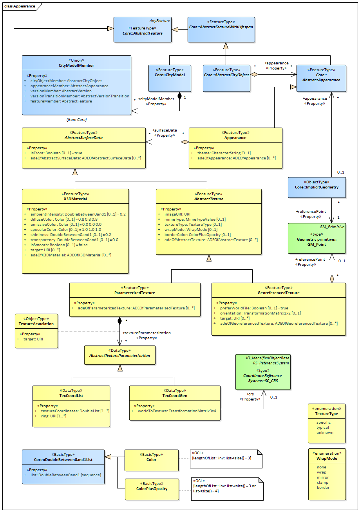
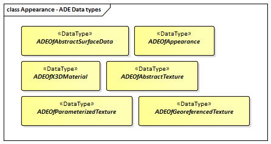

[[ug_model_appearance_section]]
=== Appearance

[[ug_appearance_synopsis_section]]
==== Synopsis

The Appearance module provides the representation of surface data such as observable properties for surface geometry objects in the form of textures and material.

Appearances are not limited to visual data but represent arbitrary categories called themes such as infrared radiation, noise pollution, or earthquake-induced structural stress. A single surface geometry object may have surface data for multiple themes. Similarly, surface data can be shared by multiple surface geometry objects (e.g. road paving).

Surface data that is constant across a surface is modelled as material based on the material definitions from the X3D and COLLADA standards. Surface data that depends on the exact location within the surface is modelled as a texture. This can either be a parameterized texture (a texture that uses texture coordinates) or a transformation matrix for parameterization, or a georeferenced texture (a texture that uses a planimetric projection).

Each surface geometry object can have both, a material and a texture per theme and side. This allows for providing a constant approximation and a complex measurement of a surface’s property simultaneously.

[[ug_appearance_concepts_section]]
==== Key Concepts

[[appearance-concept]]
<<ug_appearance_class,*Appearance*>>: An Appearance is a collection of surface data, i.e. observable properties for surface geometry objects in the form of textures and material. +
A type of <<abstract-appearance-concept,AbstractAppearance>>.

[[abstract-surface-data-concept]]
*AbstractSurfaceData*: AbstractSurfaceData is the abstract superclass for different kinds of textures and material. Textures and materials are the primitives used to render 3D objects. +
A type of <<abstract-feature-concept,AbstractFeature>>.

[[x3d-material-concept]]
*X3DMaterial*: X3DMaterial defines properties for surface geometry objects based on the material definitions from the standards X3D and COLLADA. +
A type of <<abstract-surface-data-concept,AbstractSurfaceData>>.

[[abstract-texture-concept]]
*AbstractTexture*: AbstractTexture is the abstract superclass to represent the common attributes of CityGML textures. +
A type of <<abstract-surface-data-concept,AbstractSurfaceData>>.

[[parameterized-texture-concept]]
*ParameterizedTexture*: A ParameterizedTexture is a texture that uses texture coordinates or a transformation matrix for parameterization. +
A type of <<abstract-texture-concept,AbstractTexture>>.

[[georeferenced-texture-concept]]
*GeoreferencedTexture*: A GeoreferencedTexture is a texture that uses a planimetric projection. It contains an implicit parameterization that is either stored within the image file, an accompanying world file or specified using the orientation and referencePoint elements. +
A type of <<abstract-texture-concept,AbstractTexture>>.

[[ug_appearance_discussion_section]]
==== Discussion

In addition to spatial properties, CityGML features have appearances – observable properties of the feature’s surface. Appearances are not limited to visual data but represent arbitrary categories called themes such as infrared radiation, noise pollution, or earthquake-induced structural stress. Each LOD can have an individual appearance for a specific theme. An appearance is composed of Surface Data (<<abstract-surface-data-concept,ArstractSurfaceData>>) objects. A single <<abstract-surface-data-concept,Surface Data>> object may have surface data for multiple themes. Similarly, surface data can be shared by multiple <<abstract-city-object-concept,City Objects>>. Finally, surface data values can either be constant across a surface or depend on the exact location within the surface.

A constant surface property is modelled as <<x3d-material-concept,material>>. A surface property, which depends on the location within the surface, is modelled as <<abstract-texture-concept,texture>>. Each <<abstract-city-object-concept,City Object>> can have both a material and a texture per theme and side. This allows for providing both a constant approximation and a complex measurement of a surface’s property simultaneously. An application is responsible for choosing the appropriate property representation for its task (e.g. analysis or rendering). A specific mixing is not defined since this is beyond the scope of CityGML. If a <<abstract-city-object-concept,City Object>> is to receive multiple textures or materials, each texture or material requires a separate theme. The mixing of themes or their usage is not defined within CityGML and left to the application.

In CityGML’s appearance model, themes are represented by an identifier only. The appearance of a city model for a given theme is defined by a set of <<appearance-concept,Appearance>> objects referencing this theme. Thus, the <<appearance-concept,Appearance>> objects belonging to the same theme compose a virtual group. They may be included in different places within a CityGML dataset. Furthermore a single CityGML dataset may contain several themes. An <<appearance-concept,Appearance>> object collects surface data relevant for a specific theme either for individual features or the whole city model in any LOD. Surface data is represented by objects of class <<abstract-surface-data-concept,AbstractSurfaceData>> and its descendents. The relation between a <<abstract-city-object-concept,City Object>> and <<abstract-surface-data-concept,Surface Data>> objects is expressed by the `appearance` relation from a <<abstract-city-object-concept,City Object>> to an object of type <<abstract-surface-data-concept,Surface Data>>.

[[ug-appearance-material-section]]
==== Material

Materials define light reflection properties being constant for a whole surface geometry object. The definition of the class X3DMaterial is adopted from the <<iso19775,X3D>> and <<collada,COLLADA>> specification. 

The colors of a material can have three different forms:

* diffuseColor: the color of diffusely reflected light. 
* specularColor: the color of a directed reflection. 
* emissiveColor: the color of light generated by the surface. 

All colors use RGB values with red, green, and blue between 0 and 1. 

Transparency is defined separately using the `transparency` property where 0 stands for fully opaque and 1 for fully transparent. 

The `ambientIntensity` property defines the minimum percentage of `diffuseColor` that is visible regardless of light sources. 

The `shininess` property controls the sharpness of the specular highlight. 0 produces a soft glow while 1 results in a sharp highlight. 

The `isSmooth` property gives a hint for normal interpolation. If this boolean flag is set to true, vertex normals should be used for shading (Gouraud shading). Otherwise, normals should be constant for a surface patch (flat shading).

[[ug-appearance-texture-section]]
==== Texture and texture mapping

The abstract base class for textures is <<abstract-texture-copncept,AbstractTexture>>. Textures in CityGML are always raster-based 2D textures. The raster image is specified by the `imageURI` property. This property is an URI which references an arbitrary image data resource, or even a preformatted request for a web service. The image data format can be defined using standard MIME types in the `mimeType` element.

Textures can be qualified by the attribute `textureType`. The `textureType` differentiates between textures, which are specific for a certain object (specific) and prototypic textures being typical for that object surface (typical). Textures may also be classified as unknown.

The specification of texture wrapping is adopted from the COLLADA standard. Texture wrapping is required when accessing a texture outside the underlying image raster. The `wrapMode` property can have one of five values (<<figure-15>> illustrates the effect of these wrap modes):

. none – the resulting color is fully transparent
. wrap – the texture is repeated
. mirror – the texture is repeated and mirrored
. clamp – the texture is clamped to its edges
. border – the resulting color is specified by the borderColor element (RGBA)

In wrap mode `mirror` the texture image is repeated both in horizontal and in vertical direction to fill the texture space similar to wrap mode wrap. Unlike `wrap`, each repetition results from flipping the previous texture part along the repetition direction. This behaviour removes the edge correspondence constraint for wrapped textures and always results in a seamless texture.

[[figure-15,Figure {counter:figure-num}]]
.A texture (a) applied to a facade using different wrap modes: (b) none, (c) wrap, (d) mirror, (e) clamp and (f) border. The border color is red. The numbers denote texture coordinates (image: Hasso-Plattner-Institute).

[[ug-georeferenced-texture-section]]
===== Georeferenced Texture

<<abstract-texture-concept,AbstractTexture>> is further specialised according to the texture parameterisation, i.e. the mapping function from a location on the surface to a location in the texture image. CityGML uses the notion of texture space, where the texture image always occupies the region [0,1]² regardless of the actual image size or aspect ratio. The lower left image corner is located at the origin (some graphics APIs may use other conventions and require texture coordi-nate conversion). The mapping function must be known for each surface geometry object to receive texture.

[[figure-16,Figure {counter:figure-num}]]
.A georeferenced texture applied to ground and roof surfaces (source: Senate of Berlin, Hasso-Plattner-Institute).

The class <<georeferenced-texture-concept,GeoreferencedTexture>> describes a texture that uses a planimetric projection. Consequently, it does not make sense to texture vertical surfaces using a <<georeferenced-texture-concept,GeoreferencedTexture>>. Such a texture has a unique mapping function which is usually provided with the image file (e.g. georeferenced TIFF) of an ESRI World file. The search order for an external georeference is determined by the boolean flag `preferWorldFile`. If this flag is set to true (its default value), a world file is looked for first and only if it is not found the georeference from the image data is used. If `preferWorldFile` is false, the world file is used only if no georeference from the image data is available.

Alternatively, CityGML allows for inline specification of a georeference similar to a World file. This internal georeference specification always takes precedence over any external georeference. The property `referencePoint` identifies the <<GM_Point-section,GM_Point>> which represenbts the location of the center of the upper left image pixel in world space. 

If neither an internal nor an external georeference is given the <<georeferenced-texture-concept,GeoreferencedTexture>> is invalid. 

[[ug-parameterized-texture-section]]
===== Parameterized Texture

The class <<parameterized-texture-concept,ParameterizedTexture>> describes a texture with target-dependent mapping function. 

The target of each mapping function is a subclass of class <<AbstractTextureParameterization-section,AbstractTextureParameterization>>. The `textureParmaterization` property associates an <<AbstractTextureParameterization-section,AbstractTextureParameterization>> object with the the <<parameterized-texture-concept,ParameterizedTexture>> object within which it is contained.  

The mapping function is performed through a <<TextureAssociation-section,TextureAssociation>> object. This object is a UML Association Class object which is associated with each `textureParmaterization` property. The <<TextureAssociation-section,TextureAssociation>> class contains one property which is a URI identifying a <<GM_GenericSurface-section,surface geometry>>. The <<AbstractTextureParameterization-section,AbstractTextureParameterization>> object is selected based on the URI value in the corresponding <<TextureAssociation-section,TextureAssociation>> object.

[[figure-17,Figure {counter:figure-num}]]
.Positioning of textures using texture coordinates (image: IGG Uni Bonn).

Texture coordinates are applicable only to polygonal surfaces, whose boundaries are described by <<GM_MultiSurface-section,GM_MultiSurface>> or <<GM_MultiCurve-section,GM_MultiCurve>>. They define an explicit mapping of a surface’s vertices to points in texture space, i.e. each vertex including interior ring vertices must receive a corresponding coordinate pair in texture space (for the notion of coordinates, refer to ISO 19111). These coordinates are not restricted to the [0,1] interval. Texture coordinates for interior surface points are planarly interpolated from the vertices’ texture coordinates.

[[ug-tex-coord-list-section]]
Texture coordinates for a target <<GM_GenericSurface-section,surface geometry>> object are specified using class <<TexCoordList-section,TexCoordList>> as a texture parameterization object in the texture’s target property. Each exterior and interior <<GM_MultiSurface-section,GM_MultiSurface>> or <<GM_MultiCurve-section,GM_MultiCurve>> composing the boundary of the target <<GM_GenericSurface-section,surface geometry>> object requires its own set of texture coordinates. A set of texture coordinates is specified using the `textureCoordinates` element of class <<TexCoordList-section,TexCoordList>>. Thus, a <<TexCoordList-section,TexCoordList>> contains as many `textureCoordinate` elements as the target <<GM_GenericSurface-section,surface geometry>> object contains gml:LinearRings. 

NOTE: Linear Rings are a GML construct. What do we replace it with?

textureCoordinate’s mandatory attribute ring provides the gml:id of the respective ring. The content is an ordered list of double values where each two values define a  T s,t texture coordinate pair with s denoting the horizontal and t the vertical texture axis. The list contains one pair per ring point with the pairs’ order corresponding to the ring points’ order in the CityGML document (regardless of a possibly flipped surface orientation). If any ring point of a target surface geometry object has no texture coordinates assigned, the mapping is incomplete and the respective surface cannot be textured. In case of aggregated target geometry objects, mapping completeness is determined only for leaf geometry objects.

NOTE: Update the text between this and the previous note.

[[figure-18,Figure {counter:figure-num}]]
image::figures/inwork/figure_18_a.jpg[align="center"]
.Projecting a photograph (a) onto multiple facades (b) using the worldToTexture transformation. The photograph does not cover the left facade completely. Thus, the texture appears to be clipped. Texture wrapping is set to “none” (source: Senate of Berlin, Hasso-Plattner-Institute).
image::figures/inwork/figure_18_b.jpg[align="center"]

NOTE: the rest of this section still needs updating from v 2.0

[[ug-tex-coord-gen-section]]
Alternatively, the mapping function can comprise a 3x4 transformation matrix specified by class <<TexCoordGen-section,TexCoordGen>>. The transformation matrix, specified by the `worldToTexture` element, defines a linear transformation from a spatial location in homogeneous coordinates to texture space. The use of homogeneous coordinates facilitates perspective projections as transformation, e.g. for projecting a photograph into a city model (cf. <<figure-18>>). Texture coordinates  T s,t are calculated from a space location  T x, y, z as    T T s,t  s q,t q with    T T s,t,q M x, y, z,1 . M denotes the 3x4 transformation matrix. Compared to a general 4x4 transformation, the resulting z component is ignored. Thus, the respective matrix row is omitted. Additionally, the <<TexCoordGen-section,TexCoordGen>> object uses the `crs` association to identify a <<SC_CRS-section,SC_CRS>> object which defines its CRS. A location in world space has to be first transformed into this CRS before the transformation matrix can be applied.

The following construction results in a worldToTexture transformation that mimics the process of taking a photograph by projecting a location in world space (in the city model) to a location in texture space:

NOTE: insert transformation matrix

In this formula, f denotes the focal length; w and h represent the image sensor’s physical dimensions; r

, u

, and
d

define the camera’s frame of reference as right, up and directional unit vectors expressed in world coordinates;
and P stands for the camera’s location in world space. Fig. 19 sketches this setting.

[[figure-19,Figure {counter:figure-num}]]
.Projective texture mapping. All points on a ray R starting from the projection center P are mapped to the same point T in texture space (image: Hasso-Plattner-Institute, IGG TU Berlin).
image::figures/figure_19.png[align="center"]

Alternatively, if the 3x4 camera matrix MP is known (e.g. through a calibration and registration process), it can easily be adopted for use in worldToTexture. MP is derived from intrinsic and extrinsic camera parameters (interior and exterior orientation) and transforms a location in world space to a pixel location in the image. Assuming the upper left image corner has pixel coordinates (0,0), the complete transformation to texture space coordinates can be written as (widthimage and heightimage denote the image size in pixels):

NOTE: insert formula

Please note, that worldToTexture cannot compensate for radial or other non-linear distortions introduced by a real camera lens.

Another use of worldToTexture is texturing a facade with complex geometry without specifying texture coordinates for each gml:LinearRing. Instead, only the facade’s aggregated surface becomes the texture target using a TexCoordGen as parameterization. Then, worldToTexture effectively encodes an orthographic projection of world space into texture space. For the special case of a vertical facade this transformation is given by:

NOTE: insert formula

[source,MathML]
----
<math display="block">
  <mrow class="MJX-TeXAtom-ORD">
    <mover>
      <mi mathvariant="normal">&#x2207;</mi>
      <mo stretchy="false">&#x2192;</mo>
    </mover>
  </mrow>
  <mo>&#xD7;</mo>
  <mrow class="MJX-TeXAtom-ORD">
    <mover>
      <mi>F</mi>
      <mo stretchy="false">&#x2192;</mo>
    </mover>
  </mrow>
  <mo>=</mo>
  <mrow>
    <mo>(</mo>
    <mfrac>
      <mrow>
        <mi mathvariant="normal">&#x2202;</mi>
        <msub>
          <mi>F</mi>
          <mi>z</mi>
        </msub>
      </mrow>
      <mrow>
        <mi mathvariant="normal">&#x2202;</mi>
        <mi>y</mi>
      </mrow>
    </mfrac>
    <mo>&#x2212;</mo>
    <mfrac>
      <mrow>
        <mi mathvariant="normal">&#x2202;</mi>
        <msub>
          <mi>F</mi>
          <mi>y</mi>
        </msub>
      </mrow>
      <mrow>
        <mi mathvariant="normal">&#x2202;</mi>
        <mi>z</mi>
      </mrow>
    </mfrac>
    <mo>)</mo>
  </mrow>
  <mrow class="MJX-TeXAtom-ORD">
    <mi mathvariant="bold">i</mi>
  </mrow>
  <mo>+</mo>
  <mrow>
    <mo>(</mo>
    <mfrac>
      <mrow>
        <mi mathvariant="normal">&#x2202;</mi>
        <msub>
          <mi>F</mi>
          <mi>x</mi>
        </msub>
      </mrow>
      <mrow>
        <mi mathvariant="normal">&#x2202;</mi>
        <mi>z</mi>
      </mrow>
    </mfrac>
    <mo>&#x2212;</mo>
    <mfrac>
      <mrow>
        <mi mathvariant="normal">&#x2202;</mi>
        <msub>
          <mi>F</mi>
          <mi>z</mi>
        </msub>
      </mrow>
      <mrow>
        <mi mathvariant="normal">&#x2202;</mi>
        <mi>x</mi>
      </mrow>
    </mfrac>
    <mo>)</mo>
  </mrow>
  <mrow class="MJX-TeXAtom-ORD">
    <mi mathvariant="bold">j</mi>
  </mrow>
  <mo>+</mo>
  <mrow>
    <mo>(</mo>
    <mfrac>
      <mrow>
        <mi mathvariant="normal">&#x2202;</mi>
        <msub>
          <mi>F</mi>
          <mi>y</mi>
        </msub>
      </mrow>
      <mrow>
        <mi mathvariant="normal">&#x2202;</mi>
        <mi>x</mi>
      </mrow>
    </mfrac>
    <mo>&#x2212;</mo>
    <mfrac>
      <mrow>
        <mi mathvariant="normal">&#x2202;</mi>
        <msub>
          <mi>F</mi>
          <mi>x</mi>
        </msub>
      </mrow>
      <mrow>
        <mi mathvariant="normal">&#x2202;</mi>
        <mi>y</mi>
      </mrow>
    </mfrac>
    <mo>)</mo>
  </mrow>
  <mrow class="MJX-TeXAtom-ORD">
    <mi mathvariant="bold">k</mi>
  </mrow>
</math>
----

This equation assumes n  denoting the facade’s overall normal vector (normalized, pointing outward, and being parallel to the ground), F denoting the facade’s lower left point, and widthf and heightf specifying the facade’s dimensions in world units. For the general case of an arbitrary normal vector the facade orientation matrix assumes a form similar to the camera orientation matrix:

NOTE: insert formula

==== Related concepts

The notion of appearance clearly relates to the generic coverage approach (cf. ISO 19123 and OGC Abstract specification, Topic 6). Surface data can be described as discrete or continuous coverage over a surface as two-dimensional domain with a specific mapping function. Such an implementation requires the extension of GML coverages (as of version 3.1) by suitable mapping functions and specialisation for valid domain and range sets. For reasons of simplicity and comprehensibility both in implementation and usage, CityGML does not follow this approach, but relies on textures and materials as well-known surface property descriptions from the field of computer graphics (cf. X3D, COLLADA specification, Foley et al.). Textures and materials store data as color using an appropriate mapping. If such a mapping is impractical, data storage can be customised using ADEs. A review of coverages for appearance modelling is considered for CityGML beyond version 2.0.0.

Appearance is also related to portrayal. Portrayal describes the composition and symbolisation of a digital model’s image, i.e. presentation, while appearance encodes observations of the real object’s surface, i.e. data. Even though being based on graphical terms such as textures and materials, surface data is not limited to being input for portrayal, but similarly serves as input or output for analyses on a feature’s surface. Consequently, CityGML does not define mixing or composition of themes for portrayal purposes. Portrayal is left to viewer applications or styling specification languages such as OGC Styled Layer Descriptors (SLD) or OGC Symbolo-gy Encoding (SE).

[[ug_appearance_uml_section]]
==== UML Model

The UML diagram of the Appearance module is illustrated in <<appearance-uml>>. 

[[appearance-uml]]
.UML diagram of CityGML’s Appearance model.

The ADE data types provided for the Appearance module are illustrated in <<appearance-uml-ade-types>>.

[[appearance-uml-ade-types]]
.ADE classes of the CityGML Appearance Module.

[[ug_appearance_examples_section]]
==== Examples

