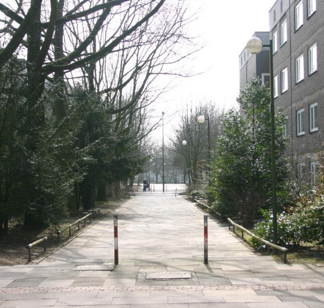
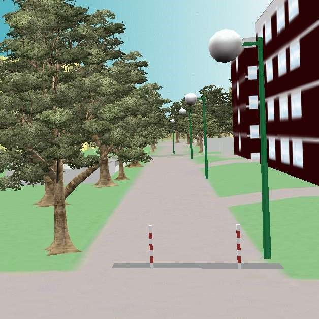
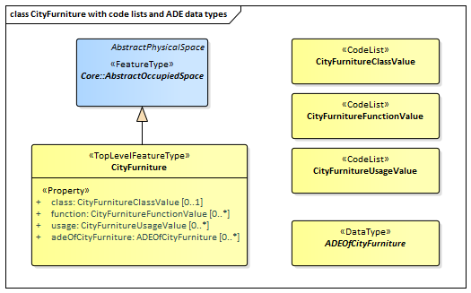
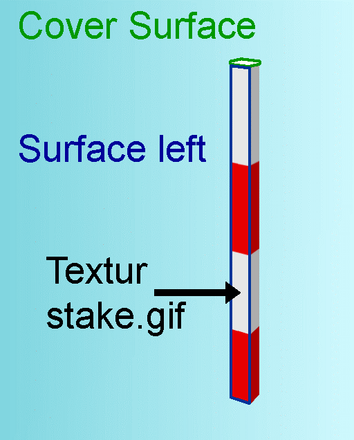

[[ug_model_city-furniture_section]]
=== City Furniture

|===
^|*Contributors*
|Chuck Heazel: first draft
|===

[[ug_city_furniture_synopsis_section]]
==== Synopsis

The CityFurniture module provides the representation of objects or pieces of equipment that are installed in the outdoor environment for various purposes, such as decoration, explanation or control. City furniture objects are relatively small, immovable objects and usually are of stereotypical form. Examples include road signs, traffic signals, bicycle racks, street lamps, fountains, flower buckets, advertising columns, and benches.

[[ug_city_furniture_concepts_section]]
==== Key Concepts

[[city-furniture-concept]]
<<CityFurniture-section,*CityFurniture*>>: CityFurniture is an object or piece of equipment installed in the outdoor environment for various purposes. Examples include street signs, traffic signals, street lamps, benches, fountains. +
A type of <<abstract-occupied-space-concept,AbstractOccupiedSpace>>.

[[ug_city_furniture_discussion_section]]
==== Discussion

NOTE: The following text needs to be reviewed and updated.

City furniture objects are immovable objects like lanterns, traffic lights, traffic signs, flower buckets, advertising columns, benches, delimitation stakes, or bus stops (<<figure-67>>, <<figure-68>>). City furniture objects can be found in traffic areas, residential areas, on squares or in built-up areas. The modelling of city furniture objects is used for visualisation of, for example city traffic, but also for analysing local structural conditions. The recognition of special locations in a city model is improved by the use of these detailed city furniture objects, and the city model itself becomes more alive and animated.

City furniture objects can have an important influence on simulations of, for example city traffic situations. Navigation systems can be realised, for example for visually handicapped people using a traffic light as routing target. Likewise, city furniture objects are important to plan a heavy vehicle transportation, where the exact position and further conditions of obstacles must be known.

[[figure-67,Figure {counter:figure-num}]]
image::figures/inwork/Figure_67_a.jpg[align="center"]
.Real situation showing a bus stop (left). The advertising billboard and the refuge are modelled as CityFurniture objects in the right image (source: 3D city model of Barkenberg).
image::figures/inwork/Figure_67_b.jpg[align="center"]

[[figure-68,Figure {counter:figure-num}]]

.Real situation showing lanterns and delimitation stakes (left). In the right image they are modelled as CityFurniture ob-jects with ImplicitGeometry representations (source: 3D city model of Barkenberg).

The class CityFurniture may have the attributes `class`, `function` and `usage`. Their possible values can be specified in corresponding <<ug-codelist-section,code lists>>. The class `attribute` allows an object classification like traffic light, traffic sign, delimitation stake, or garbage can, and can occur only once. The `function` attribute describes to which thematic area the city furniture object belongs to (e.g. transportation, traffic regulation, architecture), and can occur multiple times. The attribute `usage` denotes the real purpose of the object.

Since CityFurniture is a subclass of <<abstract-occupied-space-concept,AbstractOccupiedSpace>> and hence is a feature, it inherits the attribute `name`. As with any <<abstract-city-object-concept,CityObject>>, CityFurniture objects may be assigned <<reference,ExternalReferences>> and may be augmented by generic attributes using CityGML’s <<ug_model_generics_section,Generics>> module. For <<reference,ExternalReferences>> city furniture objects can have links to external thematic databases. Thereby, semantic information of the objects, which cannot be modelled in CityGML, can be transmitted and used in the 3D city model for further processing, for example information from systems of powerlines or pipelines, traffic sign cadaster, or water resources for disaster management.

City furniture objects can be represented in city models with their specific geometry, but in most cases the same kind of object has an identical geometry. The geometry of CityFurniture objects in LOD 1-3 may be represented by an explicit geometry (lodXGeometry where X is between 0 and 3) or an <<implicit-geometry-concept,ImplicitGeometry>> object. Following the concept of  <<implicit-geometry-concept,ImplicitGeometry>>, the geometry of a prototype city furniture is stored only once in a local coordinate system and referenced by other city furniture features. Spatial information of city furniture objects can be taken, for example, from city maps or from public and private external information systems.

In order to specify the exact intersection of the DTM with the 3D geometry of a city furniture object, the latter can have a <<terrain-intersection-curve-concept,TerrainIntersectionCurve>> (TIC) for each LOD. This allows for ensuring a smooth transition between the DTM and the city furniture object.

[[ug_city_furniture_uml_section]]
==== UML Model

The UML diagram of the CityFurniture module is depicted in <<cityfurniture-uml>>. 

[[cityfurniture-uml]]
.UML diagram of CityGML’s City Furniture model.

image::../standard/figures/CityFurniture.png[align="center"]

The ADE data types and Code Lists provided for the CityFurniture module are illustrated in <<cityfurniture-uml-ade-types>>.

[[cityfurniture-uml-ade-types]]
.ADE classes and Code Lists of the CityGML CityFurniture module.

[[ug_city_furniture_examples_section]]
==== Examples

NOTE: the following example is from version 2.0

The following example of a CityGML dataset is an extract of the model of a delimitation stake in LOD3 and contains the attributes class = 1000 and function = 1520 (delimitation stake) whose coded attribute values are taken from a code list proposed by the SIG 3D (cf. annex C.4). The delimitation stake with the object ID stake0815 has an ExternalReference pointing to a cadastre object within the German ALKIS database (www.adv-online.de) which is identified by the URI urn:adv:oid:DEHE123400007001.

The example dataset shows the geometry of the top surface (gml:id “cover”) and of the left surface (gml:id “surfLeft”) of the stake which are both depicted in Fig. 70. The top surface is assigned a constant material (white color) and the left surface is textured using the texture image stake.gif by denoting the relevant texture coordi-nates. Both surface appearances are modelled using the CityGML Appearance module (cf. chapter 9).

[[figure-70]]
.Example of a simple city furniture object (source: District of Recklinghausen).

NOTE: insert example - GML?

