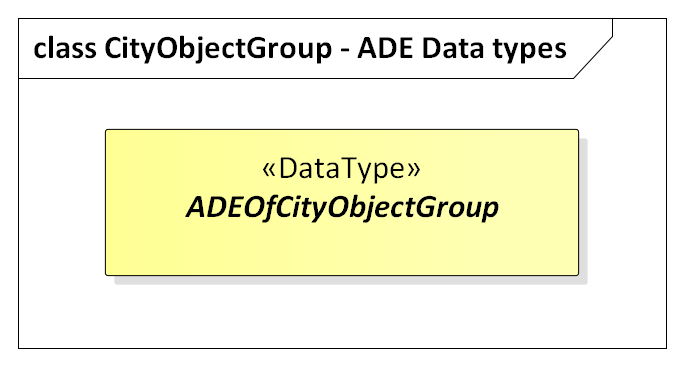
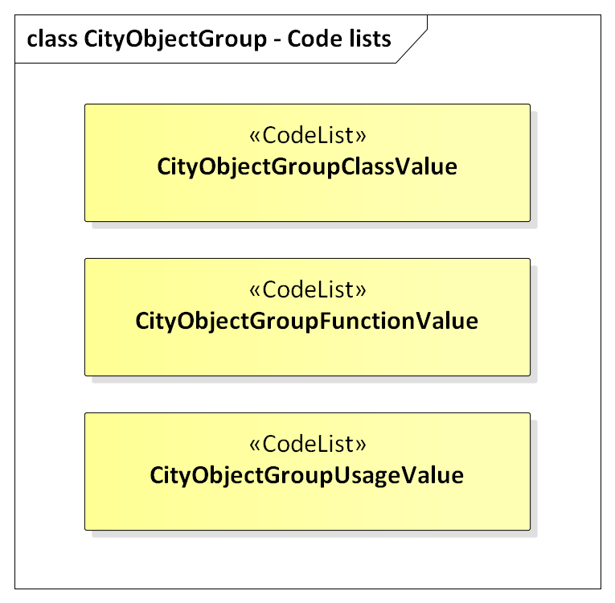

[[ug_model_city-object-group_section]]
=== City Object Group

|===
^|*Contributors*
|Chuck Heazel: first draft
|===

[[ug_city-object-group_synopsis_section]]
==== Synopsis

Aggregates City Objects into a collection of City Objects. That collection is itself a City Object.

[[ug_city-object-group_concepts_section]]
==== Key Concepts

[[city-object-group-concept]]
<<CityObjectGroup-section,*CityObjectGroup*>>: A CityObjectGroup represents an application-specific aggregation of <<abstract-city-object-concept,city objects>> according to some user-defined criteria. +
A type of <<abstract-logical-space-concept,AbstractLogicalSpace>>.

[[city-object-group-role-concept]]
<<Role-section,*Role*>>: Role is a UML Association Class tied to the `groupMember` association between <<CityObjectGroup-section,*CityObjectGroup*>> and <<abstract-city-object-concept,AbstractCityObject>>. It serves to qualify the function of a city object within the CityObjectGroup.    

[[ug_city-object-group_discussion_section]]
==== Discussion

CityObjectGroups are modelled using the Composite Design Pattern from software engineering (cf. Gamma et al. 1995): CityObjectGroups aggregate <<abstract-city-object-concept,City Objects>> and furthermore are defined as special <<abstract-city-object-concept,City Objects>>. This implies that a group may become a member of another group realizing a recursive aggregation schema. However, in a CityGML instance document it has to be ensured (by the generating application) that no cyclic groupings are included. 

The class CityObjectGroup has the optional attributes `class`, `function` and `usage`. The `class` attribute allows a group classification with respect to the stated function and may occur only once. The `function` attribute is intended to express the main purpose of a group, possibly to which thematic area it belongs (e.g. site, building, transportation, architecture, unknown etc.). The attribute `usage` can be used, if the way the object is actually used differs from the function. The `function` and `usage` attributes can occur multiple times. 

Each member of a group may be qualified by a <<Role-section,Role>>, reflecting the role each <<abstract-city-object-concept,City Object>> plays in the context of the group. Furthermore, a CityObjectGroup can optionally be assigned an arbitrary ISO <<iso-class-table,geometry object>>. This may be used to represent a generalised geometry generated from the members geometries.

The `parent` association linking a CityObjectGroup to a <<abstract-city-object-concept,CityObject>> allows for the modelling of a generic hierarchical grouping concept. Named aggregations of components (<<abstract-city-object-concept,CityObjects>>) can be added to specific <<abstract-city-object-concept,CityObjects>> considered as the parent object. The parent association links to the aggregate, while the parts are given by the group members. This concept is used, for example, to represent storeys in buildings.

[[ug_city-object-group_uml_section]]
==== UML Model

The UML diagram of the CityObjectGroup module is depicted in <<cityobject-uml>>. 

[[cityobject-uml]]
.UML diagram of the City Object Group Model.

image::../standard/figures/CityObjectGroup.png[align="center"]

The ADE data types provided for the CityObjectGroup module are illustrated in <<cityobject-uml-ade-types>>.

[[cityobject-uml-ade-types]]
.ADE classes of the CityGML CityObjectGroup module.

The Code Lists provided for the CityObjectGroup module are illustrated in <<cityobject-uml-codelists>>.

[[cityobject-uml-codelists]]
.Codelists from the CityGML CityObjectGroup module.

[[ug_city-object-group_examples_section]]
==== Examples

