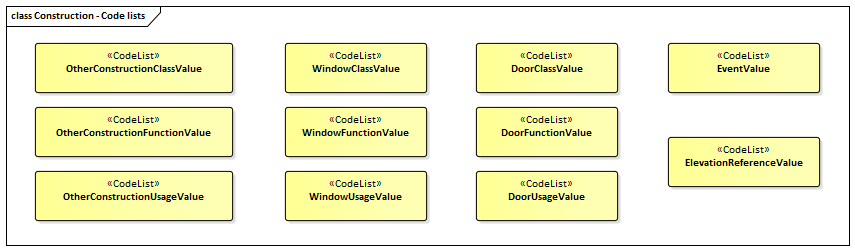

[[ug_model_construction_section]]
=== Construction

|===
^|*Contributors*
|Chuck Heazel - first draft
|===

[[ug_construction_synopsis_section]]
==== Synopsis

The Construction module defines concepts that are common to all forms of constructions. 

[[ug_construction_concepts_section]]
==== Key Concepts

[[abstract-construction-concept]]
*AbstractConstruction*: Classes of objects that are manufactured by humans from construction materials, are connected to earth, and are intended to be permanent. A type of <<abstract-occupied-space-concept,AbstractOccupiedSpace>>

[[abstract-construction-element-concept]]
*AbstractConstructionElement*: Classes that represent volumetric elements of a construction. Examples are walls, beams, slabs. A type of <<abstract-occupied-space-concept,AbstractOccupiedSpace>>.

[[abstract-filling-element-concept]]
*AbstractFillingElement*: Classes that represent different kinds of elements that fill the openings of a construction such as windows and doors. A type of <<abstract-occupied-space-concept,AbstractOccupiedSpace>>.

[[abstract-furniture-concept]]
*AbstractFurniture*: Classes that represent furniture objects of a construction. A type of <<abstract-occupied-space-concept,AbstractOccupiedSpace>>.

[[abstract-installation-concept]]
*AbstractInstallation*: Classes that represent installation objects of a construction. A type of <<abstract-occupied-space-concept,AbstractOccupiedSpace>>.

[[abstract-construction-surface-concept]]
*AbstractConstructionSurface*: Classes that represent different kinds of surfaces that bound a construction such as roof and wall surfaces. A type of <<abstract-thematic-surface-concept,AbstractThematicSurface>>.

[[abstract-filling-surface-concept]]
*AbstractFillingSurface*: Classes that represent different kinds of surfaces that seal openings. The openings are filled by filling elements such as window and door surfaces. A type of <<abstract-thematic-surface-concept,AbstractThematicSurface>>.

[[ug_construction_discussion_section]]
==== Discussion

The Construction module defines concepts that are common to all forms of constructions. Constructions are objects that are manufactured by humans from construction materials, are connected to earth, and are intended to be permanent. The Construction module focuses on as-built representations of constructions and integrates all concepts that are similar over different types of constructions, in particular buildings, bridges, and tunnels. In addition, for representing man-made structures that are neither buildings, nor bridges, nor tunnels so-called other constructions (e.g. large chimneys or city walls) can be defined.

Furniture, installations, and constructive elements are further concepts that are defined in the Construction module. Installations are permanent parts of a construction that strongly affect the outer or inner appearance of the construction and that cannot be moved (e.g. balconies, chimneys, or stairs), whereas furniture represent moveable objects of a construction (e.g. tables and chairs). Constructive elements allow for decomposing a construction into volumetric components, such as walls, beams, and slabs.

Constructions and constructive elements can be bounded by different types of surfaces. In this way, the outer structure of constructions and constructive elements can be differentiated semantically into wall surfaces, roof surfaces, ground surfaces, outer floor surfaces, and outer ceiling surfaces, whereas the visible surface of interior spaces can be structured into interior wall surfaces, floor surfaces, and ceiling surfaces.

Furthermore, the openings of constructions, i.e. windows and doors, can be represented as so-called filling elements including their corresponding filling surfaces.

The Construction module defines concepts that are inherited and, where necessary, are specialized by the modules Building, Bridge, and Tunnel  (cf. <<ug_model_building_section>>, <<ug_model_bridge_section>>, and <<ug_model_tunnel_section>>).

[[ug-construction-space-section]]
==== Construction Spaces

[[ug-construction-surfaces-section]]
==== Construction Surfaces

[[ug-construction-lod-section]]
==== Levels of Detail

The different Levels of Detail are defined in the following way:

* LOD 0: Volumetric real-world objects (Spaces) can be spatially represented by a single point, by a set of curves, [underline]#or by# a set of surfaces. +
Areal real-world objects (Space Boundaries) can be spatially represented in LOD0 by a set of curves or a set of surfaces. LOD0 surface representations are typically the result of a projection of the shape of a volumetric object onto a plane parallel to the ground, hence, representing a footprint (e.g. a building footprint or a floor plan of the rooms inside a building). LOD0 curve representations are either the result of a projection of the shape of a vertical surface (e.g. a wall surface) onto a grounding plane or the skeleton of a volumetric shape of longitudinal extent such as a road or river segment.
* LOD 1: Volumetric real-world objects (Spaces) are spatially represented by a vertical extrusion solid, i.e. a solid created from a horizontal footprint by vertical extrusion. + 
Areal real-world objects (Space Boundaries) can be spatially represented in LOD1 by a set of horizontal or vertical surfaces.
* LOD 2: Volumetric real-world objects (Spaces) can be spatially represented by a set of curves, a set of surfaces, or a single solid geometry. +
Areal real-world objects (Space Boundaries) can be spatially represented in LOD2 by a set of surfaces. The shape of the real-world object is generalized in LOD2 and smaller details (e.g. bulges, dents, sills, but also structures like e.g. balconies or dormers of buildings) are typically neglected. +
LOD2 curve representations are skeletons of volumetric shapes of longitudinal extent like an antenna or a chimney.
* LOD 3: Volumetric real-world objects (Spaces) can be spatially represented by a set of curves, a set of surfaces, or a single solid geometry. +
Areal real-world objects (Space Boundaries) can be spatially represented in LOD3 by a set of surfaces. LOD3 is the highest level of detail and respective geometries include all available shape details.

A `Construction Model` is successively refined from LOD0 to LOD3. Therefore, not all components of a construction model are represented equally in each LOD and not all aggregation levels are allowed in each LOD. In CityGML, all object classes are associated to the LODs with respect to the proposed minimum acquisition criteria for each LOD. An object can be represented simultaneously in different LODs by providing distinct geometries for the corresponding LODs.

[[ug-construction-lod0-section]]
===== LOD0

In LOD0, a `Construction Object` can be represented by two horizontal, 3-dimensional surfaces (<<abstract-thematic-surface-concept,AbstractThematicSurface>>). These two surfaces represent the foot-print of a `Construction Object` and a top surface such as a roof edge (see <<figure-lod0>>). This allows the easy integration of 2D data into the model. 

In many countries these 2D geometries readily exist, for example in cadastral or topographic data holdings. Cadastre data typically depicts the shape of a `Construction Object` on the ground (footprints). Higher level surfaces are often photogrametrically extracted from area/satellite images or derived from airborne laser data. Topographic data is often provides a mixture between footprints and geometries at higher levels. 

The surface geometries at LOD0 can be represented using <<GM_MultiCurve-section,GM_MultiCurve>> or <<GM_MultiSurface-section,GM_MultiSurface>>. 3D coordinates are required for both representations. At LOD0 it is mandated that the height values of all vertices belonging to the same surface are identical. If 2D geometries are imported into any of these two LOD0 geometries, an appropriate height value for all vertices needs to be chosen.

<<figure-lod0>> illustrates an LOD0 representation of a Building Constuction. The two horizontal 3D surfaces are colored in cyan. On the left, the building footprint is shown (cyan) which denotes the shape of the building on the ground. The corresponding surface representation is located at ground level. On the right, the Roof Edge representation is illustrated which results from a horizontal projection of the building’s roof and which is located at the eaves height

[[figure-lod0,Figure {counter:figure-num}]]
[cols="2"]
|====
a|image::figures/inwork/Figure_29_a.png[align="center",width="500"] 
a|image::figures/inwork/Figure_29_b.png[align="center",width="500"]
|====
.Modeling a construction (building) in LOD0 (source: Karlsruhe Institute of Technology (KIT), courtesy of Franz-Josef Kaiser).

Note that at LOD0 a `construction object` also has a `Space` geometry but that geometry is limited to no more than one <<GM_Point-section,GM_Point>>.

[[ug-construction-lod1-section]]
===== LOD1

In LOD1, a `construction object` consists of the generalized geometric shape of the object (<<GM_Solid-section,GM_Solid>>) as represented by its' boundary sufaces. The boundary surfaces are <<abstract-thematic-surface-concept,AbstractThematicSurfaces>> identified by the `boundary` attribute. Optionally, a <<GM_MultiCurve-section,GM_MultiCurve>> representing the <<terrain-intersection-curve-concept,TerrainIntersectionCurve>> can also be specified.

[[ug-construction-lod2-section]]
===== LOD2

This geometric representation is refined in LOD2 by additional <<GM_MultiSurface-section,GM_MultiSurface>>, <<GM_MultiCurve-section,GM_MultiCurve>>, and <<GM_Solid-section,GM_Solid>> geometries, used for modelling architectural details like roof overhangs, columns, or antennas. 

In LOD2 and higher LODs the outer facade of a `Construction Object` can also be differentiated semantically by the classes <<abstract-constructive-element-concept,AbstractConstructiveElement>> and <<abstract-installation-concept,AbstractInstallation>>. An <<abstract-constructive-element-concept,AbstractConstructiveElement>> is a structural part of the `Construction Objects` exterior shell. At LOD2 only the `boundary` surface is displayed. An <<abstract-installation-concept,AbstractInstallation>> is a non-structural part of the `Construction Objects` exterior shell. As with <<abstract-constructive-element-concept,AbstractConstructiveElement>>, only the `boundary` surface is displayed at LOD2.

The `boundary` surfaces are <<abstract-thematic-surface-concept,abstractThematicSurfaces>> identified using the `boundary` attribute of <<abstract-constructive-element-concept,AbstractConstructiveElement>> and <<abstract-installation-concept,AbstractInstallation>>. 

At LOD2 these boundary surfaces are represented as subclasses of the <<abstract-construction-surface-concept,AbstractConstructionSurface>> class. Thes subclasses represent surfaces with a special function. These subclasses are:

* roof (RoofSurface), 
* ground plate (GroundSurface),
* external walls (WallSurface), 
* interior walls (InteriorWallSurface)
* interior floors (FloorSurface)
* exterior floors (OuterFloorSurface),
* interior ceiling (CeilingSurface),
* exterior ceiling (OuterCeilingSurface),
* Closure Surface (<<closure-surface-concept,ClosureSurface>>). 

NOTE: LOD2 and LOD3 needs some work. It would be helpful if we could identify which Thematic Surface subclasses apply at each LOD.

[[ug-construction-lod3-section]]
===== LOD3

In LOD3, the openings in <<building-constructive-element-concept,BuildingConstructiveElement>> objects (doors and windows) can be represented as thematic objects. In LOD4, the highest level of resolution, also the interior of a building, composed of several rooms, is represented in the building model by the class Room. This enlargement allows a virtual accessibility of buildings, e.g. for visitor information in a museum (“Location Based Services“), the examination of accommodation standards or the presentation of daylight illumination of a building. The aggregation of rooms according to arbitrary, user defined criteria (e.g. for defining the rooms corresponding to a certain storey) is achieved by employing the general grouping concept provided by CityGML (cf. chapter 10.3.6). Interior installations of a building, i.e. objects within a building which (in contrast to furniture) cannot be moved, are represented by the class IntBuildingInstallation. If an installation is attached to a specific room (e.g. radiators or lamps), they are associated with the Room class, otherwise (e.g. in case of rafters or pipes) with _AbstractBuilding. A Room may have the attributes class, function and usage whose value can be defined in code lists (chapter 10.3.8 and annex C.1). The class attribute allows a classification of rooms with respect to the stated function, e.g. commercial or private rooms, and occurs only once. The function attribute is intended to express the main purpose of the room, e.g. living room, kitchen. The attribute usage can be used if the way the object is actually used differs from the function. Both attributes can occur multiple times.

The visible surface of a room is represented geometrically as a Solid or MultiSurface. Semantically, the surface can be structured into specialised _BoundarySurfaces, representing floor (FloorSurface), ceiling (CeilingSur-face), and interior walls (InteriorWallSurface). Room furniture, like tables and chairs, can be represented in the CityGML building model with the class BuildingFurniture. A BuildingFurniture may have the attributes class, function and usage. Annexes G.1 to G.6 provide example CityGML documents containing a single building model which is subsequently refined from a coarse LOD0 representation up to a semantically rich and geomet-ric-topologically sound LOD4 model including the building interior.

[[figure-30-2]]
.Building model in LOD1 – LOD4 (source: Karlsruhe Institute of Technology (KIT), courtesy of Franz-Josef Kaiser).<o:p></o:p>
image::figures/inwork/Figure_30.png[align="center"]

[[ug-construction-spaces-and-surfaces-section]]
==== Spaces and Surfaces

The semantic structure of a `Construction Model` is shown in <<construction-uml>>. The «FeatureType» classes in this model fall into two categories; `Spaces` and `Surfaces`. `Spaces` are descended from the <<abstract-occupied-space-concept,AbstractOccupiedSpace>> class and inherit their geometry from this class. `Surfaces` are decended from the <<abstract-thematic-surface-concept,AbstractThematicSurface>> class and inherit their geometry from that class.

[[ug-construction-occupied-spaces-section]]
===== Occupied Spaces (class AbstractOccupiedSpace)

[[ug-abstract-construction-section]]
====== Abstract Construction (class AbstractConstruction)

The <<abstract-construction-concept,AbstractConstruction>> class is used for free-standing, self-supporting constructions. It represents the construction as a whole. A construction composed of structural segments differing in, for example, the number of storeys or the roof type has to be separated into one Construction having one or more additional Construction Elements (see <<figure-28>>). The geometry and non-spatial properties of the central part of the construction should be represented in the aggregating Construction feature.

The abstract class <<abstract-construction-concept,AbstractConstruction>> contains properties for `Construction Object` attributes. These properties describe:

* `conditionOfConstruction`:
* `dateOfConstruction:
* `dateOfDemolition`:
* `constructionEvent`:
* `elevation`:
* `height`:
* `occupancy`:
* `boundary`: An association with the <<abstract-thematic-surface-concept,AbstractThematicSurface>> which defines the boundary of this `Construction Object`.

<<abstract-construction-concept,AbstractConstruction>> is a subclass of <<abstract-occupied-space-concept,AbstractOccupiedSpace>> and inherits the geometry properties from that class.

[[ug-other-construction-section]]
====== Other Construction (class OtherConstruction)

*_Under construction_*

[[ug-abstract-construction-element-section]]
====== Abstract Construction Element (class AbstractConstructionElement)

The class <<abstract-construction-element-concept,AbstractConstructionElement>> is derived from <<abstract-occupied-space-concept,AbstractOccupiedSpace>>. Subclasses of this class are used to identify the constiuent parts of a `Construc tion Object` (see <<figure-28>>). A `construction element` object should be uniquely related to exactly one `construction` or `construction element` object.

<<abstract-construction-element-concept,AbstractConstructionElement>> includes properties which describe:

* `isStructualElement`:
* `filling`:
* `boundary`: An association with the <<abstract-thematic-surface-concept,AbstractThematicSurface>> which defines the boundary of this `Construction Element Object`.

<<abstract-construction-element-concept,AbstractConstructionElement>> is a subclass of <<abstract-occupied-space-concept,AbstractOccupiedSpace>> and inherits the geometry properties from that class.

[[figure-28-2]]
.Examples of buildings consisting of one and two building parts (source: City of Coburg)
image::figures/Figure_28.png[align="center"]

[[ug-abstract-furniture-section]]
====== Abstract Furniture (class AbstractFurniture)

`Construction Objects` may have `Furnitures` and `Installations`. An <<ug-abstract-furniture-section,AbstractFurniture>> is a movable part of a `Construction`, such as a chair or table. An <<ug-abstract-furniture-section,AbstractFurniture>> object should be uniquely related to exactly one `Construction Object`. Its geometry may be represented by an explicit geometry or an <<implicit-geometry-concept,ImplicitGeometry>> object. Following the concept of <<implicit-geometry-concept,ImplicitGeometry>> the geometry of a prototype bridge furniture is stored only once in a local coordinate system and referenced by other `furniture` features.

[[ug-abstract-installation-section]]
====== Abstract Installation (class AbstractInstallation)

An <<abstract-installation-section,AbstractInstallation>> is an object inside a `Construction Object` with a specialised function or semantic meaning. In contrast to `Furniture`, <<abstract-installation-section,AbstractInstallation>> are permanently attached to the structure and cannot be moved. Examples for <<abstract-installation-section,AbstractInstallation>> are stairways, railings and heaters. An <<abstract-installation-section,AbstractInstallation>> object should be uniquely related to exactly one `Construction Object`. Its geometry may be represented by an explicit geometry or an <<implicit-geometry-concept,ImplicitGeometry>> object. Following the concept of <<implicit-geometry-concept,ImplicitGeometry>> the geometry of a prototype bridge furniture is stored only once in a local coordinate system and referenced by other `furniture` features.

An <<abstract-installation-section,AbstractInstallation>> optionally has attributes `class`, `function` and `usage`. The attribute `class`, which can only occur once, represents a general classification of the `Installation Object`. With the attributes `function` and `usage`, nominal and real functions of a `Installation Object` can be described. For all three attributes the list of feasible values can be specified in a code list.

<<abstract-installation-section,AbstractInstallation>> is a subclass of <<abstract-occupied-space-concept,AbstractOccupiedSpace>> and inherits the geometry properties from that class.

[[ug-abstract-filling-element-section]]
====== Abstract Filling Element (class AbsrtactFillingElement)

The class <<ug-abstract-filling-element-section,AbsrtactFillingElement>> is the abstract base class for semantically describing openings like doors or windows in outer or inner boundary surfaces like walls and roofs. Openings only exist in models of LOD3. Each _Opening is associated with a <<GM_MultiSurface-section,GM_MultiSurface>> geometry. Alternatively, the geometry may be given as <<implicit-geometry-concept,ImplicitGeometry>> object. Following the concept of <<implicit-geometry-concept,ImplicitGeometry>> the geometry of a prototype opening is stored only once in a local coordinate system and referenced by other opening features.

[[ug-window-section]]
======= Window (class Window)

The class Window is used for modelling windows in the exterior shell of a `Construction Object`, or between adjacent `Construction Elements`. The formal difference between the classes Window and Door is that – in normal cases – Windows are not specifically intended for the transit of people or vehicles.

[[ug-door-section]]
======= Door (class Door)

The class Door is used for modelling doors in the exterior shell of a `Construction Object`, or between adjacent `Construction Elements`. Doors can be used by people to enter or leave a `Construction Object` or `Construction Element`. In contrast to a <<ug-construction-closure-surface-section,ClosureSurface>> a door may be closed, blocking the transit of people. A Door may be assigned zero or more addresses. The corresponding Address-PropertyType is defined within the CityGML core module.

[[ug-construction-abstract-thematic-surface-section]]
===== Thematic Surfaces (class AbstractThematicSurface)

*_Under construction_*

[[ug-abstract-filling-surface-section]]
====== Filling Surfaces (class AbstractFillingSurface)

*_Under construction_*

[[ug-door-surface-section]]
======= Door Surface (class DoorSurface)

*_Under construction_*

[[ug-window-surface-section]]
======= Window Surface (class WindowSurface)

*_Under construction_*

[[ug-abstract-construction-surface-section]]
====== Construction Surfaces (class AbstractConstructionSurface)

*_Under construction_*

[[ug-roof-surface-section]]
======= Roof (class RoofSurface), 

*_Under construction_*

[[ug-ground-surface-section]]
======= Ground Plate (class GroundSurface)

The ground plate of a `Construction` or `Constructive Element` is modelled by the class <<ug-ground-surface-section,GroundSurface>>. The polygon defining the ground plate is congruent with the construction's footprint. However, the surface normal of the ground plate is pointing downwards.

[[ug-wall-surface-section]]
======= External Walls (class WallSurface), 

All parts of the `Construction` facade belonging to the outer shell can be modelled by the class <<ug-wall-surface-section,WallSurface>>.

[[ug-interior-wall-surface-section]]
======= Interior Walls (class InteriorWallSurface)

*_Under construction_*

[[ug-floor-surface-section]]
======= Interior Floors (class FloorSurface)

*_Under construction_*

[[ug-exterior-floor-surface-section]]
======= Exterior Floors (class OuterFloorSurface),

A mostly horizontal surface belonging to the outer shell of the `Construction Object` and with the orientation pointing upwards can be modeled as an <<ug-exterior-floor-surface-section,OuterFloorSurface>>.

[[ug-ceiling-surface-section]]
======= Interior Ceiling (class CeilingSurface),

*_Under construction_*

[[ug-exterior-ceiling-surface-section]]
======= Exterior Ceiling (class OuterCeilingSurface),

A mostly horizontal surface belonging to the outer shell of the `Construction Object` and having the orientation pointing downwards can be modeled as an <<ug-exterior-ceiling-surface-section,OuterCeilingSurface>>.

[[ug-construction-closure-surface-section]]
====== Closure Surface (class <<closure-surface-concept,ClosureSurface>>). 

An opening in a `Construction Object` not filled by a <<ug-door-section,door>> or <<ug-window-section,window>> can be sealed by a virtual surface called a <<closure-surface-concept,ClosureSurface>>. Hence, `Constructions` with open sides can be virtually closed in order to be able to compute their volume.

==== UML Model

The UML diagram of the Construction module is depicted in <<construction-uml>>.

[[construction-uml,Figure {counter:figure-num}]]
.UML diagram of the Construction Model.

image::../standard/figures/Construction.png[align="center"]

The ADE data types provided for the Construction module are illustrated in <<construction-uml-ade-types>>.

[[construction-uml-ade-types,Figure {counter:figure-num}]]
.ADE classes of the CityGML Construction module.
image::../standard/figures/Construction-ADE_Datatypes.png[align="center"]

The Code Lists provided for the Construction module are illustrated in <<construction-uml-codelists>>.

[[construction-uml-codelists,Figure {counter:figure-num}]]
.Codelists from the CityGML Construction module.

[[ug_construction_examples_section]]
==== Examples

