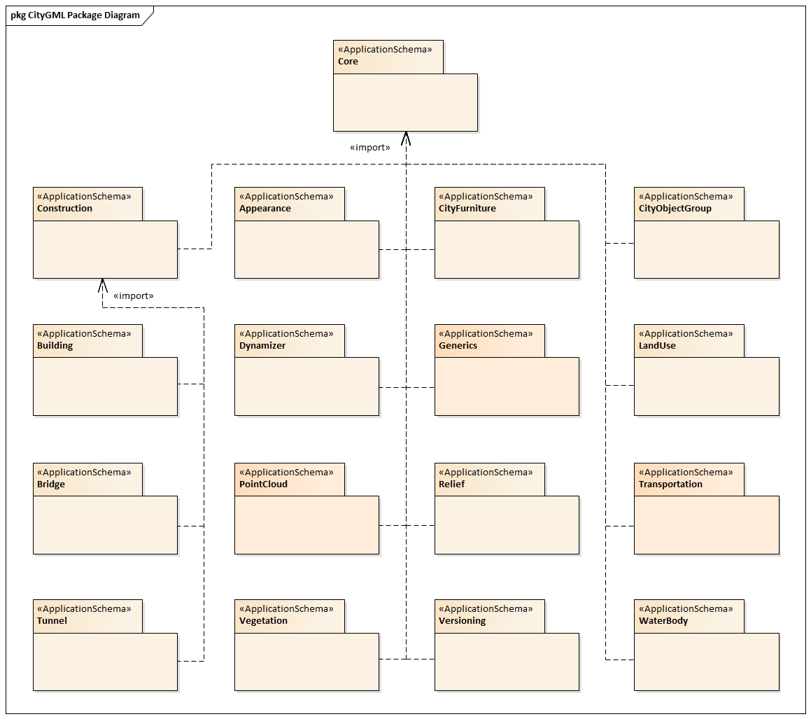

[[data-dictionary-section]]
== CityGML Data Dictionary

The CityGML UML model is the normative definition of the CityGML Conceptual Model. The Data Dictionary tables in this section were software generated from the UML model. As such, this section provides a normative representation of the CityGML Conceptual Model.

[[data-dictionary-package-diagram,Figure {counter:figure-num}]]
.CityGML UML Packages

[[ISO-classes-dd]]
=== ISO Classes

The following classes are defined in ISO standards and used by the CityGML Conceptual Model.

[[data-dictionary-ISO]]
include::../standard/data-dictionaries/ISO-Classes.adoc[]

[[data-dictionary-core]]
include::../standard/data-dictionaries/Core.adoc[]

[[data-dictionary-appearance]]
include::../standard/data-dictionaries/Appearance.adoc[]

[[data-dictionary-city_furniture]]
include::../standard/data-dictionaries/CityFurniture.adoc[]

[[data-dictionary-city_object-group]]
include::../standard/data-dictionaries/CityObjectGroup.adoc[]

[[data-dictionary-dynamizer]]
include::../standard/data-dictionaries/Dynamizer.adoc[]

[[data-dictionary-generics]]
include::../standard/data-dictionaries/Generics.adoc[]

[[data-dictionary-land_use]]
include::../standard/data-dictionaries/LandUse.adoc[]

[[data-dictionary-pointcloud]]
include::../standard/data-dictionaries/PointCloud.adoc[]

[[data-dictionary-relief]]
include::../standard/data-dictionaries/Relief.adoc[]

[[data-dictionary-transportation]]
include::../standard/data-dictionaries/Transportation.adoc[]

[[data-dictionary-vegetation]]
include::../standard/data-dictionaries/Vegetation.adoc[]

[[data-dictionary-versioning]]
include::../standard/data-dictionaries/Versioning.adoc[]

[[data-dictionary-waterbody]]
include::../standard/data-dictionaries/WaterBody.adoc[]

[[data-dictionary-construction]]
include::../standard/data-dictionaries/Construction.adoc[]

[[data-dictionary-bridge]]
include::../standard/data-dictionaries/Bridge.adoc[]

[[data-dictionary-building]]
include::../standard/data-dictionaries/Building.adoc[]

[[data-dictionary-tunnel]]
include::../standard/data-dictionaries/Tunnel.adoc[]
